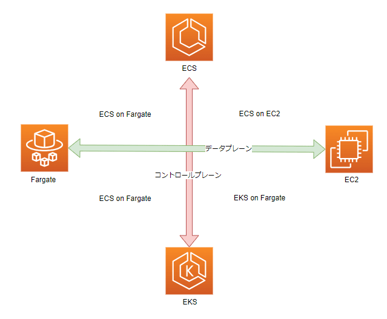
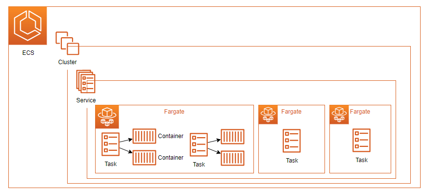
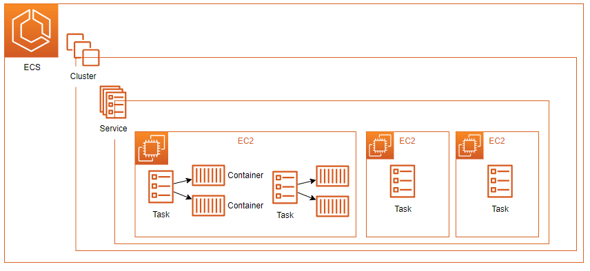
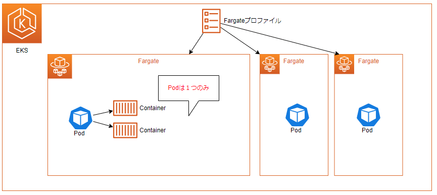
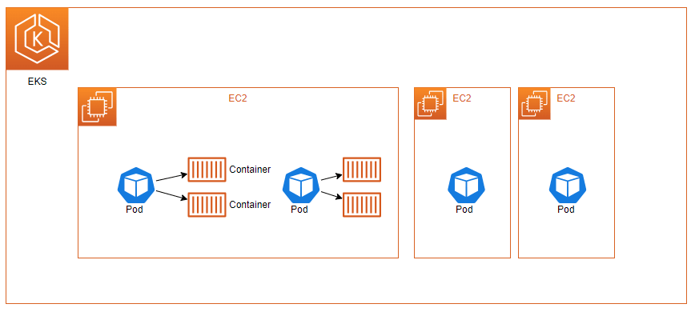

>[【初心者向け】Amazon ECS と EKS 入門！完全ガイド](https://zenn.dev/issy/articles/zenn-ecs-vs-eks)
>

# AWS ECSとは
- ECSはElastic Container Serviceの略で、Dockerコンテナ化されたアプリケーションのデプロイ、管理、スケーリングを容易にするフルマネージ
ドコンテナオーケストレーションサービス

# ECSとEKSの違い
- コンテナオーケストレーションの選択

コンテナオーケストレーションのソフトウェアが、Kubernetes (K8s) か AWS オリジナルか、という違いです。

## EKS（Elastic Kubernetes Service）

- **提供者**: Amazon Web Services (AWS)
- **特徴**: AWS 上で、独自の Kubernetes コントロールプレーンをインストール、運用、保守する必要がないフルマネージドコンテナオーケストレーションサービスです。

## ECS（Elastic Container Service）

- **提供者**: Amazon Web Services (AWS)
- **特徴**: EKS は コンテナオーケストレーション に Kubernetes を利用していますが、ECS は AWS オリジナルのソフトウェアをベースに構築されている コンテナ化されたアプリケーションのデプロイ、管理、スケーリングを容易にするフルマネージドコンテナオーケストレーションサービスです。

# コンテナオーケストレーション
コンテナのワークロードやサービス、ライフサイクル管理やデプロイメント等のコンテナに関わる調整と管理の自動化技術のことで、コントロールプレーンとデータプレーンから成り立っています。

# ECS概要

## コントロールプレーン
コントロールプレーンとは、コンテナを管理する機能（＝コンテナオーケストレータ）のことを指します。つまり、ECS、EKS のことです。

## データプレーン
データプレーンとは、コンテナが実際に稼働するリソース環境を指します。

AWS が提供するデータプレーンは次の 2 種類あります。

- **EC2**
- **Fargate**

## データプレーンの種類

AWS が提供するデータプレーンは次の 2 種類あります。

### EC2
- **概要**: コンテナが稼働するリソースの管理を利用者自身で行うもの
- **メリット**:
  - スペック（CPU コア数、メモリ、ストレージ 等）が柔軟に選択できる
  - 実稼働リソースの OS に直接介入することが出来る（カーネルパラメータなどをチューニングする 等）
  - コンテナイメージを EC2 内にキャッシュできるので Fargate タイプに比べてデプロイが早い
- **デメリット**:
  - ホストの管理（サーバのスケーリング、パッチ 等）が必要

### Fargate
- **概要**: コンテナが稼働するリソースの管理を AWS が行ってくれるもの
- **メリット**:
  - ホストの管理（サーバのスケーリング、パッチ 等）が不要
- **デメリット**:
  - スペック（CPU コア数、メモリ、ストレージ 等）に制限がある（決まった構成からのみ選択可能）
  - 実稼働リソースの OS に直接介入することが出来ない（カーネルパラメータなどをチューニングする 等）
  - コンテナイメージをキャッシュできないので EC2 タイプに比べてデプロイが遅い
  - ただし、ロードマップ上には、[Fargate/ECS] [Image caching]: provide image caching for Fargate. があるので将来的には・・
  - EC2 タイプに比べて価格が高い

これだけを見ると、Fargate のデメリットが多いように思えますが、コンテナが実際に稼働するリソース環境の運用から解放されるのは非常に大きなメリットですので、作業要員のコストも考えるとデメリットを上回る価値があると考えられ

# 4 つのアーキテクチャパターン
コントロールプレーンとデータプレーンの組み合わせで 4 つのアーキテクチャパターンがあります。

- ECS on Fargate

- ECS on EC2

- EKS on Fargate

  - Fargate には 1 つの Pod しか起動できない制約(Fargate Pod の設定)があります。
    - そのため、DaemonSet が利用できません。
    - ログ集約などで利用したい場合、サイドカーコンテナを作成する方法があります。
    - [（参考：AWS Fargate で Amazon EKS を使用するときにアプリケーションログをキャプチャする方法）](https://aws.amazon.com/jp/blogs/news/how-to-capture-application-logs-when-using-amazon-eks-on-aws-fargate/)

- EKS on EC2

# ECS と EKS のサービスの利用想定の比較

### EKS（Elastic Kubernetes Service）
- **利用想定**:
  - 既に Kubernetes (K8s)を利用している、またはこれから積極的に利用してコンテナの管理を行いたい方向け
  - オンプレミスや他のクラウド上でも稼働させたい場合に適しています

### ECS（Elastic Container Service）
- **利用想定**:
  - K8s の運用経験がないか、K8s よりも簡単にコンテナの管理を行いたい方向け
  - AWS のみで利用できればよい場合に適しています

### 注意点
- K8s は基本的に 3 か月に 1 回のアップデートが行われるため、アップデートに追従するために運用コストが高くなる傾向があります。

# デプロイフロー
- ECRにDockerイメージをプッシュ
- ECSの更新処理

