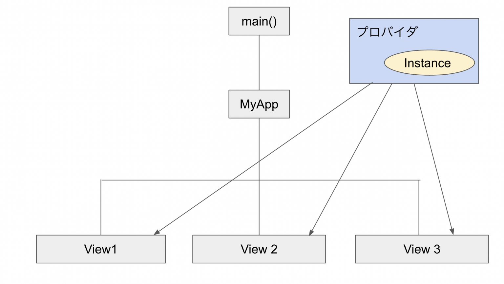

# RiverPod概要
- アプリ全体で共有する状態を管理するプラグイン/フレームワーク
- Riverpodでは、プロバイダと呼ばれるオブジェクトに値やインスタンスを格納し、このプロバイダを必要な時にViewで呼び出すことで、ツリーのどの位置でも値の呼び出し、参照を可能にします。
- >概念図

- アプリのパフォーマンスを最適化
  - ウィジェット更新の条件を限定
  - 負荷が高いステートの計算をキャッシュしたりといったことが可能
  - ステートの変化による外部への影響をコントロール
- アプリのテスト容易性を高める 
  - プロバイダがあれば setUp や tearDown のような面倒な手順は不要
  - テスト中のプロバイダの挙動をオーバーライドできる
  - これにより特異な条件下での動作も確認しやすくなる
- ロギングやプルリフレッシュ（画面を引っ張って更新）などの高度な機能との組み合わせが容易に実現
- View（UIデザイン）とViewModel(UIの振る舞い)を分離できる
- クリーンアーキテクチャ的にPresentation/Provider層に配置
- プロバイダー内でビジネスロジックを呼び出す
## プロバイダの種類
- Provider
  - 最も基本的なProvider
  - 生成されるステートの型 : 任意
  - 具体例
    - ビジネスロジック・レポジトリクラス / 算出プロパティ（リストのフィルタなど）
- Notifier: **もっとも推奨**
  - Riverpod 2.0 新要素で`StateProvider` と `StateNotifierProvider` の両方の挙動をカバーするプロバイダ
  - 今後は Notifier（と AsyncNotifier） 推奨
  - Notifier を継承したクラスを作成することで、StateNotifier のようにより柔軟な State の監視が可能に
- StateProvider :非推奨 
  - 外部から変更可能な状態を提供する
  - 生成されるステートの型 : 任意
  - 具体例
    - フィルタの条件 / シンプルなステートオブジェクト
- StateNotifierProvider : 
  - `Notifier`で代用可能
  - 外部から変更可能な状態と、状態操作メソッドクラスを提供する
  - 生成されるステートの型 : StateNotifier のサブクラス
  - 具体例
    - イミュータブル<不変>（インタフェースを介さない限り）で複雑なステートオブジェクト
  - 非同期対応型`AsyncStateNotifierProvider`もある
- FutureProvider
  - 非同期で取得した値を提供する
  - 生成されるステートの型 : 任意の Future
  - 具体例
    - API の呼び出し結果
- StreamProvider
  - 断続的に最新の値を提供する
  - 生成されるステートの型 : 任意の Stream
  - 具体例
    - API の呼び出し結果の Stream
- (非推奨)ChangeNotifierProvider
  - 変更可能な状態を持つクラスを提供する
  - 生成されるステートの型 : ChangeNotifier のサブクラス
  - 具体例
    - ミュータブルで複雑なステートオブジェクト
  - 拡張性が求められるアプリの開発に ChangeNotifierProvider を使用することはおすすめできません。 
  - ミュータブル（可変）なステートが様々な問題を引き起こす可能性があるためです。 
  - 基本的には package:provider からの移行を容易にするため、そして Navigator 2.0 系のパッケージでの使用など Flutter 特有のユースケースに対応するために存在しています。

