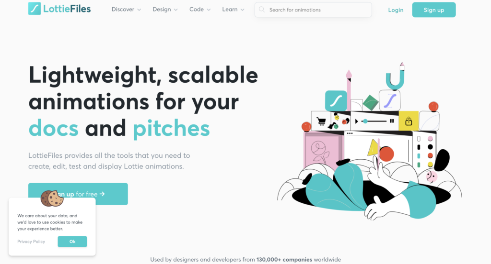

# 概要
>https://medium.com/flutter-jp/implicit-animation-b9d4b7358c28
>https://www.flutter-study.dev/create-ui/animation
- うまく設計されたアニメーションはUIをより直感的に感じさせ、洗練されたアプリのスマートなルック＆フィールに貢献し、ユーザーエクスペリエンスを向上させます。
- Flutterのアニメーションサポートにより、様々な種類のアニメーションを簡単に実装することができます。
- 多くのウィジェット、特にMaterialウィジェットには、その設計仕様で定義された標準的なモーションエフェクトが付属していますが、これらのエフェクトをカスタマイズすることも可能です。

# アニメーション(Animation)の実装する方法
- Flutterでは、アニメーションを実装する際に複数のアプローチが存在します。
- 大きく3つのカテゴリに分かれ、8つのアプローチがあります。
  - Animation Framework
    - riveやLottieなどのフレームワーク
  - Low-Level Animation	
    - CustomPainter
  - Explicit Animation
    - AnimatedBuilder
    - FooTransition
    - Subclass AnimatedWidget
  - Implicit Animation
    - AnimatedDefaultTextStyle
    - AnimatedFoo
    - TweenAnimationBuilder

Flutterの公式で以下のような判断軸で選ぶように推奨

## 各フレームワークやウィジェットの概要
### rive

  - riveは2Dのアニメーションを簡単に作成できるツールであり、それらの作成した２DアニメーションのファイルはFlutterのライブラリを活用することで簡単に呼び出すことができます。
  - そのため、多くのアニメーションをチームで開発する場合、アニメーションの開発ツールとしてriveを利用し、riveを扱うためのFlutterのライブラリを利用することが想定されるでしょう。
### Lottie

  - Lottieもrive同様、アニメーションを簡単に作成、導入することができるライブラリになります。
  - JSON情報を読み込むような形でアニメーションを導入するため、アニメーションが軽量でサクサク動きます。
  - 前述したriveよりもFlutter界隈では利用者が多いように思います。（ライブラリのLIKE数もLottieが多い。）
### AnimatedBuilder
>https://www.youtube.com/watch?v=N-RiyZlv8v8
- AnimatedBuilderは汎用的に使えるアニメーションクラスです。
- 設定した図形を回転させたり、縮小したり、拡大するような汎用的なアニメーションを自動的に継続するような設定ができます。
- アニメーションを設定する対象を、子ウィジェットに設定することでウィジェットごとに複雑なアニメーションを設定したい場合はこちらのクラスを使うと良さそうです。
### FooTransition
「FooTransition」のFooの部分は、~Transitionと呼ばれるウィジェットが他にもありそれらを総称して「FooTransition」としています。

一般的に使われるTransition系のウィジェットとして以下のようなものがあります。
- AlignTransition
  - Alignのアニメーション
- DecoratedBoxTransition
  - DecoratedBoxのアニメーション
- DefaultTextStyleTransition
  - DefaultTextStyleのアニメーション
- PositionedTransition
  - Positionedのアニメーション
- RelativePositionedTransition
  - Positionedのアニメーション
- RotationTransition
  - ウィジェットの回転をアニメーション化
- ScaleTransition
  - ウィジェットのスケールをアニメーション化
- SizeTransition
  - 独自のサイズをアニメーション化
- SlideTransition
  - ウィジェットの通常の位置を基準にアニメーション化
- FadeTransition
  - Opacityのアニメーション
- AnimatedModalBarrier
  - ModalBarrierのアニメーション
###  AnimatedWidget
>https://www.youtube.com/watch?v=LKKgYpC-EPQ

ウィジェットをサブクラス化してビルド関数を実装すればAnimatedWidgetを利用することができます。

アニメーションのパラメーターをproviderで管理すれば、ChangeNotifierやValueNotifierなどの変更通知を受け取りアニメーションに影響を与えることが可能です。

FooTransition系のウィジェットよりも複雑なアニメーションを行いたい場合に利用すると良いでしょう。
### AnimatedDefaultTextStyle
AnimatedDefaultTextStyleは子ウィジェットとなるTextウィジェットの内容をアニメーション化します。

文字列をアニメーション化したい場合はこちらのウィジェットを選べば問題ないでしょうか。

AnimatedFoo
「AnimatedFoo」のFooの部分は、Animated~と呼ばれるウィジェットが他にもあり、それらを総称して「AnimatedFoo」としています。

一般的に使われるAnimated系のウィジェットとして以下のようなものがあります。

TweenAnimationBuilder	Tweenによって表現されたプロパティを指定されたターゲット値にアニメーション化
AnimatedAlign	Alignをアニメーション化
AnimatedContainer	Containerをアニメーション化
AnimatedDefaultTextStyle	DefaultTextStyleをアニメーション化
AnimatedScale	Transform.scaleをアニメーション化
AnimatedRotation	Transform.rotateをアニメーション化
AnimatedSlide	ウィジェットの通常の位置を基準にアニメーション化
AnimatedOpacity	Opacityをアニメーション化
AnimatedPadding	Paddingをアニメーション化
AnimatedPhysicalModel	PhysicalModelをアニメーション化
AnimatedPositioned	Positionedをアニメーション化
AnimatedPositionedDirectional	PositionedDirectionalをアニメーション化
AnimatedTheme	Themeをアニメーション化
AnimatedCrossFade	指定された2つの子の間でクロスフェードし、サイズ間で自分自身をアニメーション化
AnimatedSize	指定された期間にわたってサイズを自動的に移行
AnimatedSwitcher	ウィジェット間でフェード
AnimatedFooとFooTransitionの違い
「AnimationControllerを管理する必要があるのか？」によって用途が変わってきます。

Animated: AnimationControllerを管理しない、簡単に扱える（細かい制御ができない）
Transition: AnimationControllerを管理して、細かい制御が可能
TweenAnimationBuilder

永続的にアニメーションを実行したいが、AnimatedFooでは細かな設定ができない時はTweenAnimationBuilderが便利です。

子ウィジェットに表示したい内容を設定し、パラメーターでアニメーションを実行する時間を設定できます。

