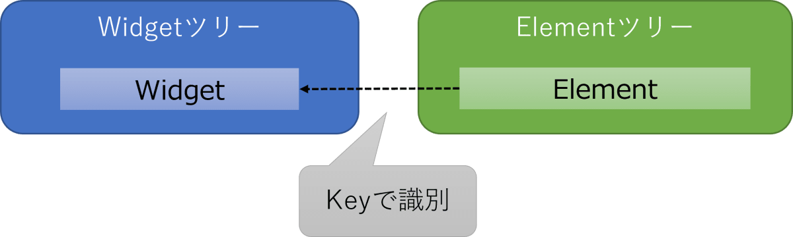
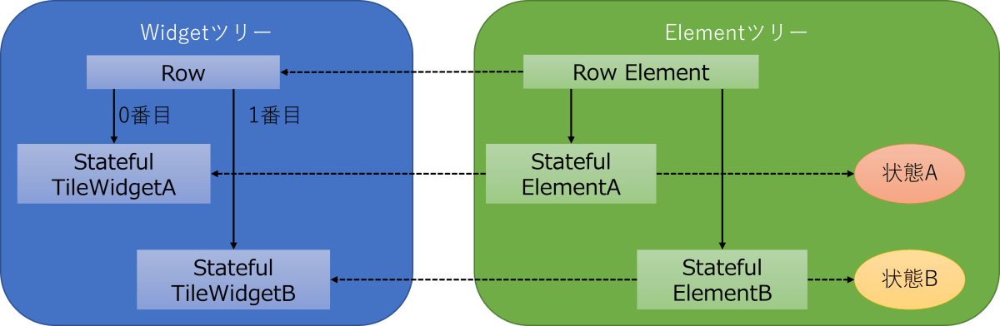

# Key
>https://zenn.dev/kazutxt/books/flutter_practice_introduction/viewer/55_chapter6_key

- KeyとはWidgetを識別するために用いられるもの
- ElementがWidgetの状態を管理しているがその際に、`Element`は`Key`を使って`Widget`を識別しています。

- `Key`は意図的に指定しないとデフォルトでは`null`

!!! fff Keyには、アプリ内でユニークとなる「GlobalKey」と親Widget配下でユニークとなる「LocalKey」の2種類があります。今回利用したUniqueKeyはLocalKeyに分類されます。

# 使用例
## 動作確認用アプリの概要
このアプリを使って、Keyを個別に設定せずにコンテナが交換されない例と、Keyを個別に設定しコンテナが交換される例の2つを見ていきます。
このアプリをWidgetツリーとElementツリーで表すと下図のようになります。

## 交換されない例
まず、Keyを設定せずに交換がうまく行われない例から見ていきます。
前提として、Keyは明示的に設定しない場合は、nullが設定されます。
### 実装例
色の付いた2つのコンテナをボタンのタップで入れ替えるアプリを考えます。
_MyHomePageStateでは、StatefulTileを2つ作成しボタンがタップされるたびに、入れ替えを行うようにしています。
```dart
lib/main.dart
import 'package:flutter/material.dart';
import 'stateful_tile.dart';

// main関数、MyApp、MyHomePageはデフォルトから変更がないため省略
class _MyHomePageState extends State<MyHomePage> {
  late List<Widget> tiles;
  @override
  void initState() {
    super.initState();
    //2つのStatefulWidgetが準備
    tiles = [
      StatefulTile(),
      StatefulTile(),
    ];
  }

  // 入れ替え処理
  void changeTiles() {
    setState(() {
      tiles.insert(1, tiles.removeAt(0));
    });
  }

  @override
  Widget build(BuildContext context) {
    return Scaffold(
      appBar: AppBar(
        title: Text(widget.title),
      ),
      body: Row(children: tiles),
      floatingActionButton: FloatingActionButton(
        onPressed: changeTiles,
        tooltip: 'Increment',
        child: const Icon(Icons.add),
      ),
    );
  }
}
```
StatefulTileは、ただの色付きのコンテナです。入れ替わりをわかりやすくするために、色をランダムに生成しています。また、ビルドが行われたことを確認できるように、buildメソッドの中にprintを入れて、ターミナルに文字を出力しています。
```dart
lib/stateful_tile.dart
import 'dart:math';
import 'package:flutter/material.dart';

class StatefulTile extends StatefulWidget {
  StatefulTile({Key? key}) : super(key: key);
  @override
  _StatefulTileState createState() => _StatefulTileState();
}

class _StatefulTileState extends State<StatefulTile> {
  Color _color = Colors.black;
  final _random = Random();
  // initStateで色を設定する
  @override
  void initState() {
    super.initState();
    _color = Color.fromRGBO(
        _random.nextInt(256), _random.nextInt(256), _random.nextInt(256), 1);
  }

  // ビルド内では色は最初に作ったものを使う
  @override
  Widget build(BuildContext context) {
    print("build");
    return Container(color: _color, height: 100, width: 100);
  }
}
```

