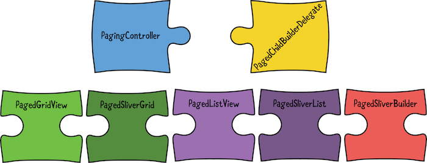
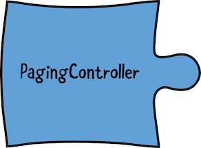
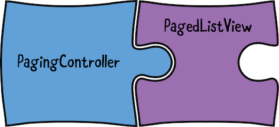
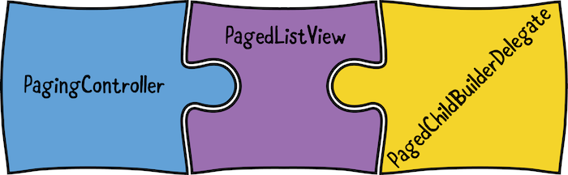

次のレイアウトに最も適したものをお選びください。

Infinite Scroll Pagination パッケージのすべてのクラスは、ジグソーパズルのピースとして表現されています。

## まずは、`PagingController`を定義する
そして、これが最初のピース`PagingController`


- PagingControllerは、ページングされたウィジェットのコントローラ
- ページ分割の現在の状態を保持し、必要なときにリスナーからページを要求する役割を担う

FlutterのTextEditingControllerやScrollControllerなどを扱ったことがある人なら、PagingControllerはなじみやすいと思います。
### PagingController のインスタンス化
lib/ui/list/paged_article_list_view.dart に戻り、ファイルの一番上に新しいライブラリへの import を追加します。
```dart
import 'package:infinite_scroll_pagination/infinite_scroll_pagination.dart';
```
ここで、 // TODO: PagingController のインスタンスを作成する に置き換えてください。
```dart
// 1 インスタンスを作成する際には、2 つの一般的な型を指定する必要
//`int`: これは、エンドポイントがページを識別するために使用するタイプです。 
//今回使う`API`の場合、ページ番号です。他の API では、違うタイプが使われます。
//このページ分割戦略の多様性から、このパッケージではこれらの識別子を **page keys** と呼ぶ
//`Article`:リスト項目をモデル化する型
final _pagingController = PagingController<int, Article>(
  // 2 firstPageKey パラメータを使って、ページ初期値を設定する必要がある
  //今回使う`API`の場合、ページキーは1から始まりますが、他のAPIの場合は0から始まるかもしれない
  firstPageKey: 1,
);

@override
void initState() {
  // 3 新しいページの要求をリッスンしてそれを処理する関数を登録する
  _pagingController.addPageRequestListener((pageKey) {
    _fetchPage(pageKey);
  });
  super.initState();
}

Future<void> _fetchPage(int pageKey) async {
  // TODO: Implement the function's body.
  //ページを要求されたら取得処理をするコードを書く
}

@override
void dispose() {
  // 4 コントローラを dispose() するのを忘れないように
  _pagingController.dispose();
  super.dispose();
}
```
上のコードが何をするのか、順を追って説明します。
1. `PagingController` のインスタンスを作成する際には、2 つの一般的な型を指定する必要があります。あなたのコードでは、それらは
   1. `int`: これは、エンドポイントがページを識別するために使用するタイプです。 今回使う`API`の場合、ページ番号です。他の API では、違うタイプが使われます。このページ分割戦略の多様性から、このパッケージではこれらの識別子を **page keys** と呼ぶ
   2. `Article`:リスト項目をモデル化する型
2. firstPageKey パラメータを使って、ページ初期値を設定する必要がある
   - 今回使う`API`の場合、ページキーは 1 から始まりますが、他の API の場合は 0 から始まるかもしれない
3. 新しいページの要求をリッスンしてそれを処理する関数を登録する
4. コントローラを dispose() するのを忘れないように
### ページの取得
`_fetchPage()`の実装をこれに置き換えること
```dart
Future<void> _fetchPage(int pageKey) async {
  try {
    final newPage = await widget.repository.getArticleListPage(
      number: pageKey,
      size: 8,
      // 1 現在のフィルタリングとソートのオプションをリポジトリに転送している
      filteredPlatformIds: _listPreferences?.filteredPlatformIds,
      filteredDifficulties: _listPreferences?.filteredDifficulties,
      filteredCategoryIds: _listPreferences?.filteredCategoryIds,
      sortMethod: _listPreferences?.sortMethod,
    );

    final previouslyFetchedItemsCount =
        // 2 itemListは、PagingControllerのプロパティです。
        //これまでに読み込まれたすべてのアイテムを保持します。
        //itemListの初期値はnullなので、?条件付きプロパティアクセスを使用しています。
        _pagingController.itemList?.length ?? 0;

    final isLastPage = newPage.isLastPage(previouslyFetchedItemsCount);
    final newItems = newPage.itemList;

    if (isLastPage) {
      // 3 新しい項目を作成したら、`appendPage()`あるいは`appendLastPage()`をコールしてそれをコントローラに知らせます。
      _pagingController.appendLastPage(newItems);
    } else {
      final nextPageKey = pageKey + 1;
      _pagingController.appendPage(newItems, nextPageKey);
    }
  } catch (error) {
    // 4 エラーが発生した場合は、コントローラのerrorプロパティにその値を指定します。
    _pagingController.error = error;
  }
}
```
1. 現在のフィルタリングとソートのオプションをリポジトリに転送している
2. itemListは、PagingControllerのプロパティです。これまでに読み込まれたすべてのアイテムを保持します。itemListの初期値はnullなので、?条件付きプロパティアクセスを使用しています。
3. 新しい項目を作成したら、`appendPage()`あるいは`appendLastPage()`をコールしてそれをコントローラに知らせます。
4. エラーが発生した場合は、コントローラのerrorプロパティにその値を指定します。

ビルドして実行し、エラーが発生していないことを確認します。視覚的、機能的な変化は期待しないでください。
## PaginatedListViewの使い方

2つ目のピースは、その名前が示すとおり、通常のListViewのページ分割バージョンです。
そして図が示すように、そこにあなたのコントローラを収めることになります。

lib/ui/list/paged_article_list_view.dart で、古い build() を置き換えてください。
```dart
@override
Widget build(BuildContext context) =>
    // 1 FlutterのRefreshIndicatorでスクロール可能なウィジェットをラッピングすると、
    //swipe to refreshと呼ばれる機能が使えるようになります。
    //ユーザーはこれを利用して、リストを上から下に引っ張って更新することができます。
    RefreshIndicator(
      onRefresh: () => Future.sync(
        // 2 PagingController は refresh() というデータを更新する関数を定義している
        //refresh() の呼び出しを Future でラップしているのは、 
        //RefreshIndicator の onRefresh パラメータがそれを想定しているから
        () => _pagingController.refresh(),
      ),
      // 3 PagedListView には、リストアイテムの間にセパレータを追加するための 
      //separated() コンストラクタが用意されています。
      child: PagedListView.separated(
        // 4 パズルのピース(pagingController)をつなげる
        pagingController: _pagingController,
        padding: const EdgeInsets.all(16),
        separatorBuilder: (context, index) => const SizedBox(
          height: 16,
        ),
      ),
    );
```
Here’s what’s going on:
1. FlutterのRefreshIndicatorでスクロール可能なウィジェットをラッピングすると、swipe to refreshと呼ばれる機能が使えるようになります。ユーザーはこれを利用して、リストを上から下に引っ張って更新することができます。
2. PagingController は refresh() というデータを更新する関数を定義しています。refresh() の呼び出しを Future でラップしているのは、 RefreshIndicator の onRefresh パラメータがそれを想定しているから
3. PagedListView には、リストアイテムの間にセパレータを追加するための separated() コンストラクタが用意されています。
4. パズルのピース(pagingController)をつなげていく
## リストアイテムを構築するためにBuilder Delegateを作成する
- 3つ目のピースを埋める


最後の仕上げとして、`PagedListView`にこの新しいパラメータを`pagingController`、`padding`、`separatorBuilder`と同じレベルで指定して、コード内の同じギャップを埋めます。
```dart
builderDelegate: PagedChildBuilderDelegate<Article>(
  itemBuilder: (context, article, index) => ArticleListItem(
    article: article,
  ),
  firstPageErrorIndicatorBuilder: (context) => ErrorIndicator(
    error: _pagingController.error,
    onTryAgain: () => _pagingController.refresh(),
  ),
  noItemsFoundIndicatorBuilder: (context) => EmptyListIndicator(),
),
```
`PagedChildBuilderDelegate`は、無限スクロールのページネーションに関わるすべてのウィジェットのためのビルダーのコレクションである。
このコードでは3つのパラメータしか指定していないが、7つのパラメータをすべて知っておくと、将来的に役に立つかもしれない。
- `itemBuilder`: これはリスト項目を構築するものです。これは唯一の必須パラメータで、他のパラメータはすべてデフォルトです。
- `firstPageErrorIndicatorBuilder`: これは、最初のページの取得にエラーが発生したことをユーザーに通知するウィジェットを構築するものです。このシナリオでは、リストアイテムはまだロードされていないので、このウィジェットがスペース全体を埋めるようにします。インジケータに再試行ボタンを追加する場合は、コントローラで `refresh()` を呼び出すことを確認してください。
- `newPageErrorIndicatorBuilder`: これもまたエラーを示しますが、それ以降のページ要求に対してです。すでにいくつかのアイテムがロードされているので、ここで作成したウィジェットはリストの一番下に表示されます。インジケータに再試行ボタンを追加する場合は、ユーザーがボタンをタップしたときに、コントローラで `retryLastRequest()` を呼び出すことを確認してください。
- `firstPageProgressIndicatorBuilder`: これは、最初のページをロードしている間に表示されるウィジェットを構築します。まだアイテムはロードされていないので、このウィジェットがスペース全体を埋めるようにします。
- `newPageProgressIndicatorBuilder`: これは前のビルダーと似ていますが、後続のページをロードしている間に表示されます。すでにいくつかのアイテムがロードされているため、ここで構築したウィジェットはリストの一番下に表示されます。
- `noItemsFoundIndicatorBuilder`: APIがうまくいって空のリストを返した場合はどうでしょうか？技術的にはこれはエラーではなく、通常は選択されたフィルタオプションが多すぎることに関連しています。ここで作成したウィジェットは、この「0件」のシナリオをカバーしています。
- `noMoreItemsIndicatorBuilder`: ここでは、ユーザーがリストの最後に到達したときに表示するウィジェットをオプションで作成します。

ビルドして実行します。下のGIFに示すように、デバイスの接続をオフにして、スワイプで更新してみてください。これは、`RefreshIndicator`とカスタム エラー インジケータ ウィジェットの両方をテストするのに役立ちます。
