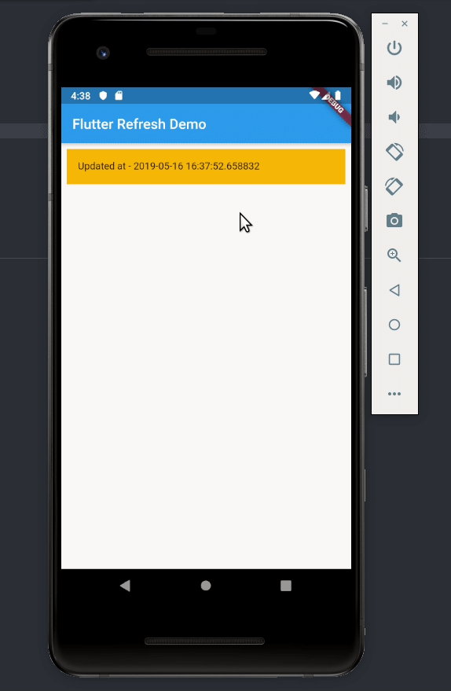

# RefreshIndicatorとは？
>https://api.flutter.dev/flutter/material/RefreshIndicator-class.html
>https://virment.com/flutter-how-to-use-refreshindicator-scrollable-view/
>https://stackoverflow.com/questions/57972505/pull-down-to-refresh-in-flutter
>https://www.youtube.com/watch?v=ORApMlzwMdM
[クラス引数説明](https://flutter.takuchalle.dev/docs/widget/refreshindicator/)
- マテリアルの「スワイプで更新」イディオムをサポートするウィジェットです。
- 画面を本来の長さ以上にスクロールする（オーバースクロール）と画面が更新される機能をサポートする



- このオーバースクロールで画面を更新する、または任意の処理を実行する機能は、Flutterの`RefreshIndicator`というウィジェットで定義されている
- `RefreshIndicator`は、スクロールできる要素を含む形で実装します。
  - 公式ドキュメントでは`Scrollable`（スクローラブル）な要素と表現されており、スクローラブルな要素として`ListView`や`SingleSchildScrollView`が挙げられています。
    - `RefreshIndicator`はこれらの要素を包んだ状態で使います。
    - 逆に言えば`RefreshIndicator`は、中にスクローラブルな要素が含まれていないと動作しません。 
- なお、`RefreshIndicator`は別途パッケージをインストールする必要はなく、デフォルトで使用可能です。
# RefreshIndicatorの使い方
使い方は非常に簡単です。冒頭に載せたデモのように一番シンプルな使い方の場合、作業としては以下の２つのみです。
- RefreshIndicatorでListViewなどのスクローラブルな要素を包む
- RefreshIndicatorで包んだ要素がオーバースクロールされた時に実行する関数を定義する

上記についてそれぞれ説明します。

## スクローラブルな要素をRefreshIndicatorで包む
以下のように、ListViewをRefreshIndicatorで包みます。以下でonRefresh:というオプションがあり、これに渡された関数がオーバースクロールされた時に実行される関数になります。すなわち、以下の場合はオーバースクロール時に_onRefreshという関数が呼び出され実行されます。
```dart
main.dart
@override
  Widget build(BuildContext context) {
    return Scaffold(
      appBar: AppBar(
        title: Text(widget.title),
      ),
      body: new RefreshIndicator(
          onRefresh: _onRefresh,
          child: ListView(
            physics: const AlwaysScrollableScrollPhysics(),
            padding: const EdgeInsets.all(8.0),
            children: [
              Container(
                padding: const EdgeInsets.all(16.0),
                height: 50,
                color: Colors.amber[600],
                child: Text("Updated at - " + updated_at.toString()),
              ),
            ],
          )),
    );
}
```
## オーバースクロールされた時に実行する関数を定義する
オーバースクロールされた時に実行する関数を例えば以下のように定義します。以下では、単純に適当な変数のupdated_atに実行時の時間を格納しています。
```dart
main.dart
class _MyHomePageState extends State {
DateTime updated_at = new DateTime.now();

Future _onRefresh() async {
    setState(() {
      updated_at = new DateTime.now();
    });
}

@override
  Widget build(BuildContext context) {
return Scaffold(
（...以下省略...）
```
そしてこの記事の載せたデモでは、このupdated_atを以下のようにそのままテキストで出力するようにしています。
```dart
main.dart
child: Text("Updated at - " + updated_at.toString()),
```
## スクロールできるほどの長さがない画面の対応について
もしスクロールできるほど画面が長くない場合は、AlwaysScrollableScrollPhysics()というオプションをListViewなどのスクローラブルな要素の中で指定します。このオプションを設定することで、画面の長さに関わらず常にスクロール機能が使えるようになり、同時にRefreshIndicatorも機能します。
```dart
main.dart
body: new RefreshIndicator(
  onRefresh: _onMyRefresh,
    child: ListView(
      physics: const AlwaysScrollableScrollPhysics(), // このオプションを指定
（...以下省略...）
```
# まとめ
ここでは簡単なデモになりましたが、RefreshIndicatorを使ってスクロールされた時に最新情報を取得するなどよく見る機能を簡単に実装できます。


