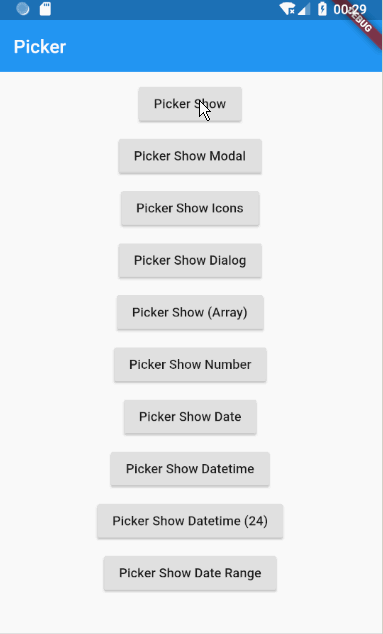

## 様々なアイテムを選択しやすくするピッカー
>https://pub.dev/packages/flutter_picker


## インストール
`flutter pub add flutter_picker`

## ダイアログで数字を選択する
```dart
import 'package:flutter/material.dart';
import 'package:flutter_picker/flutter_picker.dart';
///フォントサイズを変更する汎用的ダイアログを表示する
void showSelectFontSizeDialog(
  BuildContext context,
  WidgetRef ref, {
  ///フォントサイズを変更した後に呼び出すコールバック
  void Function(int value)? confirmCallBack,
}) {
  final appConfig = ref.watch(AppCfgProvider);
  var fontSize = readFontSize(context, ref, appConfig);
  Picker(
    //ダークテーマの時は背景を黒にする
    backgroundColor: Theme.of(context).brightness == Brightness.dark
        ? ThemeData.dark().primaryColor
        : Colors.grey[100],
    title: const Text('Please select a font size'),
    adapter: NumberPickerAdapter(
      data: [
        NumberPickerColumn(
          begin: 1,
          end: 60,
          initValue: fontSize.toInt(),
        ),
      ],
    ),
    textStyle: Theme.of(context).textTheme.titleLarge,
    hideHeader: true,
    onSelect: (picker, index, selected) {
      fontSize = selected[index].toDouble();
    },
    onConfirm: (Picker picker, List value) {
      if (confirmCallBack != null) {
        confirmCallBack(fontSize.toInt() + 1);
      }
      //UI再描画用プロバイダーを呼んでUIを再描画する
      ref.watch(onChangedProvider.notifier).state += 1;
    },
  ).showDialog(context);
}
```


