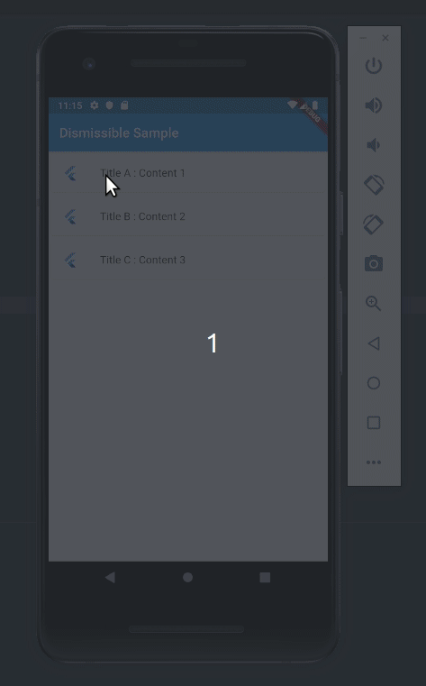

# スライド
## Dismissibleで削除

```dart
ListView.builder(
  itemCount: oneList.length
  itemBuilder: (context, index){
    return Dismissible(
        // background: 第1背景
  // ・backgroundのみ指定 → 両スワイプ時の背景
  // ・secondaryBackgroundも指定 → 右スワイプ時の背景
    background: Container(
      color: Colors.red,
      child: Icon(Icons.delete, color: Colors.white),
      ),
    // onDismissedの中にスワイプされた時の動作を記述
    // directionにはスワイプの方向が入るため、方向によって処理を分けられる
    onDismissed: (direction){
    // endToStart（画面左から右）
    //startToEnd（画面右から左）
      setState((){oneList.removeAt(index);});
      },
    // KeyはFlutterが要素を一意に特定できるようにするための値を設定する
    key: UniqueKey(),
      child: ListTile(
      title: Text(oneList[index]),
      ),
    );
  },
)
```
!!! tip 使用例
```dart
Dismissible(
    key: UniqueKey(),
            onDismissed: (direction) {
              setState(() {
                ref
                    .watch(webUsecaseProvider)
                    .editRecentSearches(txt, isAddOrRemove: false);
              });
            },
            //削除以外の選択肢も
            secondaryBackground: Container(
              color: Colors.green,
              alignment: Alignment.centerRight,
              child: Text("Temp"),
            ),
            //どんなに方向を変えても必ず左に配置されてしまう
            background: Container(
              color: Colors.red,
              alignment: Alignment.centerLeft,
              child: Row(
                children: const [
                  Padding(padding: EdgeInsets.all(10)),
                  Icon(Icons.delete_sweep, color: Colors.white),
                  Padding(padding: EdgeInsets.all(5)),
                  Text('Delete', style: TextStyle(color: Colors.white)),
                ],
              ),
            ),
            child: ListTile(
                onTap: () {
                  //これを検索に入れて検索開始
                },
                title: Text(txt)),
          );
```

