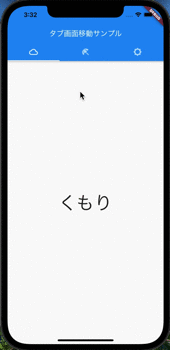

# TabBar

- 「TabBar」を作るときは、
  1. 「TabBar」、「TabBarView」に「TabController」クラスを設定するか
  2. 「DefaultTabController」の子要素としてそれぞれを作成する方法の2種類があります。
## DefaultTabController」での作成方法
```dart
return DefaultTabController(
  length: _tab.length,
  child: Scaffold(
    appBar: AppBar(
      title: const Text('TabBar'),
      bottom: TabBar(
        tabs: _tab,
      ),
    ),
    body: TabBarView(
      children: <Widget> [
        TabPage(title: 'Car', icon: Icons.directions_car),
        TabPage(title: 'Bisycle', icon: Icons.directions_bike),
        TabPage(title: 'Boat', icon: Icons.directions_boat),
      ]
    ),
  ),
);
```
「DefaultTabController」には必ず、「TabBar」で表示するタブ数をlengthに設定しておかなければなりません。
```dart
return DefaultTabController(
  length: _tab.length,
  child: Scaffold(
    appBar: AppBar(
```
次に「AppBar」のbottomに「TabBar」クラスを定義して、表示するタブのリストを渡します。
```dart
appBar: AppBar(
  title: const Text('TabBar'),
  bottom: TabBar(
    tabs: _tab,
  ),
),
```
今回は「Tab」の一覧は_tab変数に定義しておきます。
```dart
  final _tab = <Tab> [
    Tab( text:'Car', icon: Icon(Icons.directions_car)),
    Tab( text:'Bisycle', icon: Icon(Icons.directions_bike)),
    Tab( text:'Boat', icon: Icon(Icons.directions_boat)),
  ];
```
これで、タブの表示ができましたが、画面表示の切り替えも確認しましょう。
bodyに「TabBarView」クラスを定義し、表示する画面となるウィジェットの一覧を渡します。
今回は「TabPage」という画面ウィジェットを作ってあるので、一覧として設定して完成です。
```dart
body: TabBarView(
  children: <Widget> [
    TabPage(title: 'Car', icon: Icons.directions_car),
    TabPage(title: 'Bisycle', icon: Icons.directions_bike),
    TabPage(title: 'Boat', icon: Icons.directions_boat),
  ]
),
```
## TabController
今度は「TabController」での書き方をみてみましょう。
```dart
class _MainPageState extends State<MainPage> with SingleTickerProviderStateMixin {

  TabController _tabController;
  //TabController使う時は必ずinitStateメソッドで、初期化し、disposeメソッドで破棄
  @override
  void initState() {
    super.initState();
    _tabController = TabController(vsync: this, length: _tab.length);
  }

  @override
  void dispose() {
    _tabController.dispose();
    super.dispose();
  }

  Widget build(BuildContext context) {
    return Scaffold(
      appBar: AppBar(
        title: const Text('TabBar'),
        bottom: TabBar(
          controller: _tabController,
          tabs: _tab,
        ),
      ),
      body: TabBarView(
        controller: _tabController,
        children: <Widget> [
          TabPage(title: 'Car', icon: Icons.directions_car),
          TabPage(title: 'Bisycle', icon: Icons.directions_bike),
          TabPage(title: 'Boat', icon: Icons.directions_boat),
        ]
      ),
    );
  }
}
```
このように「TabController」を使うときは必ずinitStateメソッドで、初期化し、disposeメソッドで破棄を書いてください。
こうすることで、_MainPageStateの作成、破棄と同じタイミングで「TabController」も作成、破棄が行われるようになります。
```dart
  TabController _tabController;

  @override
  void initState() {
    super.initState();
    _tabController = TabController(vsync: this, length: _tab.length);
  }

  @override
  void dispose() {
    _tabController.dispose();
    super.dispose();
  }
  ```
次に「TabBar」、「TabBarView」それぞれに「TabController」を設定することで、タブが動作するようになるので、完成です。
```dart
bottom: TabBar(
  controller: _tabController,
  tabs: _tab,
),
body: TabBarView(
  controller: _tabController,
  children: <Widget> [
    TabPage(title: 'Car', icon: Icons.directions_car),
    TabPage(title: 'Bisycle', icon: Icons.directions_bike),
    TabPage(title: 'Boat', icon: Icons.directions_boat),
  ]
),
```


