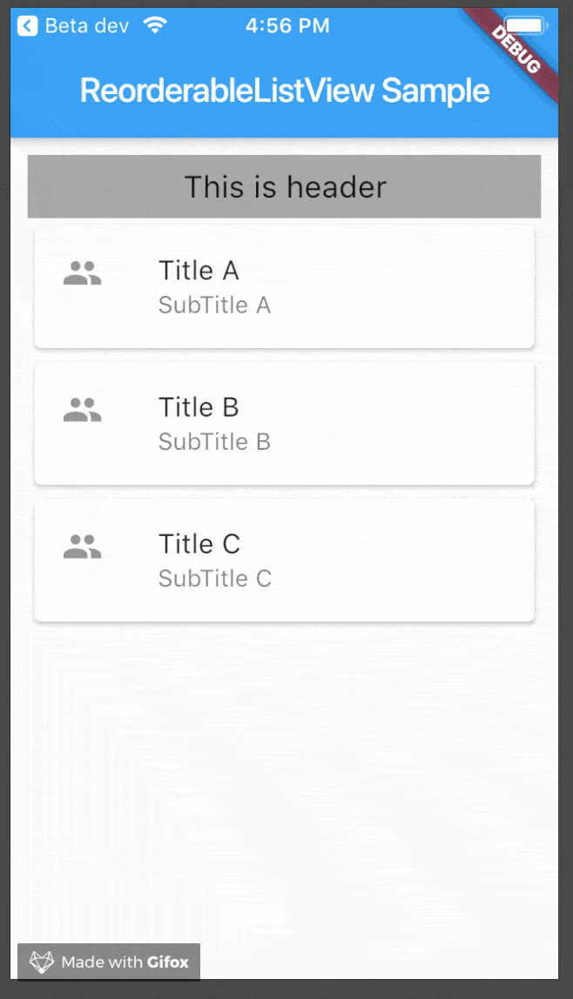

# 順序変更可能なリスト表示・ReorderableListView
[公式Doc](https://api.flutter.dev/flutter/material/ReorderableListView-class.html)
>https://flutter.gakumon.jp/entry/flutter-reorderable-list
>https://tech-rise.net/flutter-about-reorderable-list-view/
- ReorderableListView.builder()の名前付きコンストラクタを利用
  - ListView同様、builderのコンストラクタの方が扱いやすい場面が多い
- 順序変更を永続化してアプリが中断されても変更された順序を継続する必要


## 主なプロパティ
- children
  - リストの内容
- header
  - リストのヘッダー
- onReorder 
  - リストの項目を変更しようとする時に実行される関数
  - 引数oldIndexは、つまみ上げられた項目のもともとのインデックス
  - newIndexがつまんだ項目をドロップした場所のインデックス
  - この情報を使ってリストを更新する定形的な処理
    ```dart
          onReorder: (int oldIndex, int newIndex) {
        if (oldIndex < newIndex) {
          newIndex -= 1;
        }
        final ListItem item = list.removeAt(oldIndex);
        list.insert(newIndex, item);
      }
    ```
  - 古いインデックスにあるitemをremoveして(その返り値が取り除かれた項目)、これを新しいインデックスの場所に挿入
- padding 
  - ListView全体の余白
## ポイント
- 全てのリストの項目にKeyプロパティが必要
  - リストの各項目を一意に識別するために、全ての項目にkeyプロパティを設定する必要がある
- onReorderメソッドの実装
  - ドラッグ&ドロップをした時にこのメソッドが呼ばれます。
```dart
onReorder: (oldIndex, newIndex) {
  if (oldIndex < newIndex) {
  // 移動前のインデックスより移動後のインデックスが大きい場合、アイテムの長さがリストの保有数よりも1大きくなってしまうため、
  // newIndexから1引きます。
    // 例えば、上の画像のように1番目のアイテムを3番目に移動した場合、oldIndex = 0, newIndex = 3となります。
  // newIndexを1引いて2とします。
  // 
    newIndex -= 1;
  }

  // 0番目のアイテムをリストから出します
  final Model model = modelList.removeAt(oldIndex);

  setState(() {
  // index = 2にアイテムを挿入します
    modelList.insert(newIndex, model);
  });
},
```
- 並べ替えのUIは処理系によって変わる
  - Androidで実行した場合は右の二重線がなく、つまむ場所が見当たらない
    - Androidではリストビューの並び替えはロングタップがデフォルトの操作


## 使用例
```dart
class _MyHomePageState extends State<MyHomePage> {
  List<Model> modelList;

  @override
  void initState() {
    super.initState();
    modelList = [];
    List<String> titleList = ["Title A", "Title B", "Title C"];
    List<String> subTitleList = ["SubTitle A", "SubTitle B", "SubTitle C"];
    for (int i = 0; i < 3; i++) {
      Model model = Model(
        title: titleList[i],
        subTitle: subTitleList[i],
        key: i.toString(),
      );
      modelList.add(model);
    }
  }

  @override
  Widget build(BuildContext context) {
    return Scaffold(
        appBar: AppBar(
          title: Text(widget.title),
        ),
        body: Container(
          child: ReorderableListView(
            padding: EdgeInsets.all(10.0),
            header: Container(
              width: MediaQuery.of(context).size.width,
              color: Colors.grey,
              padding: const EdgeInsets.all(8.0),
              child: Center(
                child: Text(
                  "This is header",
                  style: TextStyle(fontSize: 18.0),
                ),
              ),
            ),
            onReorder: (oldIndex, newIndex) {
              if (oldIndex < newIndex) {
                // removing the item at oldIndex will shorten the list by 1.
                newIndex -= 1;
              }
              final Model model = modelList.removeAt(oldIndex);

              setState(() {
                modelList.insert(newIndex, model);
              });
            },
            children: modelList.map(
              (Model model) {
                return Card(
                  elevation: 2.0,
                  key: Key(model.key),
                  child: ListTile(
                    leading: const Icon(Icons.people),
                    title: Text(model.title),
                    subtitle: Text(model.subTitle),
                  ),
                );
              },
            ).toList(),
          ),
        ));
  }
}

class Model {
  final String title;
  final String subTitle;
  final String key;

  Model({
    required this.title,
    required this.subTitle,
    required this.key,
  });
}
```


