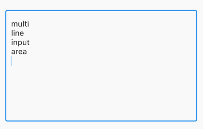

# TextField
>https://zenn.dev/kboy/books/ca6a9c93fd23f3/viewer/14dfcb

# TextFormField
[【Flutter】TextFormFieldパターン別デザイン設定方法](https://note-tmk.hatenablog.com/entry/2022/08/17/230826)
>https://zenn.dev/pressedkonbu/articles/copy-paste-text-form-field#%E3%83%87%E3%83%95%E3%82%A9%E3%83%AB%E3%83%88
>https://zenn.dev/monkeydaichan/articles/14133cb66c0682
>https://zenn.dev/pressedkonbu/articles/copy-paste-text-form-field
>https://flutter.ctrnost.com/basic/interactive/form/textfield/

## ヒント付きテキスト

```dart
TextFormField(
    decoration: InputDecoration(
      border: OutlineInputBorder(),//枠線
      //選択した際の枠線の色を設定
      focusedBorder: OutlineInputBorder(
            borderSide: BorderSide(color: Colors.red, width: 2),
      //フォームの横にアイコンを表示
      icon: Icon(Icons.search),
      //フォーム内にアイコンを表示
      prefixIcon: Icon(Icons.search),
      //
      labelText: "label text",
      hintText: "this is hint text.",
      ),
  ),
```
## 複数行入力
- デフォルトではTextFormFieldには1行しか入力ができない。 しかしmaxLinesを1より大きくすることで複数行入力が可能になる。
- この時にkeyboardType: TextInputType.multilineを併せて設定することで、キーボードのEnterで改行することができる。

```dart
TextFormField(
    maxLines: 10,
    keyboardType: TextInputType.multiline,
    decoration: InputDecoration(border: OutlineInputBorder()),
  ),
```
# 入力履歴


## 背景色
- fillColorプロパティに色を指定し、filledをtrueに設定

## 検証
- TextFormFieldにはvalidatorというプロパティがあり、条件に合わない入力に対して赤文字でエラーを出す機能を備えている
- 「TextFormField」では、validatorが利用可能です。
validator()メソッドに実装を書くことで入力チェックを可能にしています。
- autovalidateを設定すると文字列入力と同時にvalidator()メソッドが呼ばれるようになります。
  - これには少し欠点があり、初回表示時にもチェックがかかっているので、表示時点で項目がエラー表示されてしまうので注意が必要です。
- onSaved()メソッドは、処理全体が保存されるタイミングで呼び出されます。

# AutocompleteWidgetでフォームの自動補完機能を実装する
>https://qiita.com/taisei_dev/items/f4d22e1e17febc80cd79


