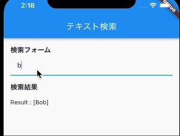

# 検索機能で使えるテクニック
>https://www.kamo-it.org/blog/flutter-text-search/

検索処理にAPIを利用する場合は、TextFieldのonChangedのイベントが走るたびに、APIを叩くことになります。
結果的に動作が重くなったり、検索自体がうまくいかない場合があります。
そんな時には、ユーザーが入力し終えたら検索処理をするという実装をすると良いと思います。
「ユーザーが最後の文字を打ってから、1秒経過したら検索をかける」という場合の例をご紹介します。

## 具体例
まずは、遅らせる秒数を定義します。(各自で調整してください)
そして、最後に文字を入力した日時をStatefulWidgetのStateに保持します。
```dart
static const searchDelayMillSec = 1000;
DateTime _lastChangedDate = DateTime.now();
```
検索を遅らせる処理は以下の通りです。

文字を打つたびに_lastChangedDateが更新される
その1秒後にFuture.delayedの中の検索処理が走る という流れです。
```dart
 void delayedSearch(String text) {
    Future.delayed(const Duration(milliseconds: searchDelayMillSec), () {
      final nowDate = DateTime.now();
      if (nowDate.difference(_lastChangedDate).inMilliseconds > searchDelayMillSec) {
        _lastChangedDate = nowDate;
        search(text);
      }
    });
    //キーワードが入力されるごとに、検索処理を待たずに_lastChangedDateを更新する
    _lastChangedDate = DateTime.now();
  }
```
Future.delayedの中の検索処理が走る前に次の文字を入力すると、_lastChangedDateが再度更新され、
```dart
if (nowDate.difference(_lastChangedDate).inMilliseconds > searchDelayMillSec)
```
という条件はfalseになります。
したがって、1秒以内に次の文字が入力された場合には、検索処理は走りません。
以下にコード全文をコピペ用に置いておきます。
少し難しいので、実際に動かしてみるとイメージがつきやすいかもしれません。


