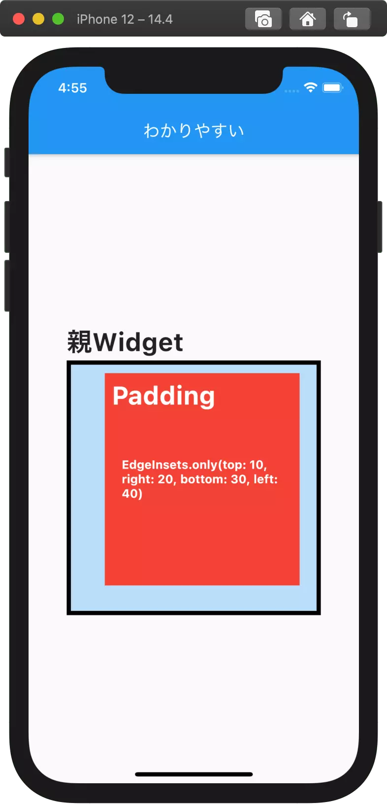

# PADDING
>https://nzigen.com/reference/flutter/2018-04-15-padding/

Padding と EdgeInsets を組み合わせることで、Widget の内側に余白を持たせることができます。

## Paddingとは
Padding は余白を作るための Widget です。
```dart
Padding(
   padding: EdgeInsets.all(30),
   child: Container(color: Colors.red),
)
```
のように書きます。

引数 child には、余白の中の要素を、padding には、持たせたい余白の大きさを指定します。

上の例の、`EdgeInsets.all(20)` は四方すべてに 20 ピクセルずつ均等に余白を持たせます。

## padding値の指定方法
`EdgeInsets.all(30)` の他にも、
```
EdgeInsets.only(top: 30)
```
とすることで、上方向にのみ余白をもたせることもできます。

また、
```
EdgeInsets.only(top: 10, right: 20, bottom: 30, left: 40)
```
のように、四方のパディングの大きさを自由に設定することができます。


さらに、EdgeInsets.symmetryを用いれば、上下または左右の余白を簡潔に記述できます。
```
EdgeInsets.symmetry(horizontal:10, vertical: 40);
```

## Container.padding と Padding の使い分け
Container.padding 引数と Padding の 2 つの間には特に違いはありませんが、padding だけのために Container を使うと分かりにくいので、できるだけ Padding を使いましょう。
```dart
children: <Widget>[
  // 同じ結果に
  Container( // paddingだけを入れたい場合、Containerは非推奨
    padding: EdgeInsets.all(20),
    child: Container(color: Colors.red),
  ),
  Padding( // 推奨
    padding: EdgeInsets.all(20),
    child: Container(color: Colors.red),
  ),
],
```

