# レイアウトの考え方・仕組み
>https://codezine.jp/article/detail/14711
>https://docs.flutter.dev/development/ui/widgets/layout
- [レイアウトの考え方・仕組み](#レイアウトの考え方仕組み)
- [レイアウトウィジェットの役割](#レイアウトウィジェットの役割)
- [主な単一のためのレイアウトウィジェット](#主な単一のためのレイアウトウィジェット)
  - [Container（単一レイアウトの基本形）](#container単一レイアウトの基本形)
    - [パディング(余白)/マージン値の指定方法](#パディング余白マージン値の指定方法)
    - [飾りをつける](#飾りをつける)
  - [Centerウィジェット/Alignウィジェット](#centerウィジェットalignウィジェット)
  - [AspectRatioウィジェット（サイズを比率で指定する）](#aspectratioウィジェットサイズを比率で指定する)
- [主なMulti-child layout Widgets](#主なmulti-child-layout-widgets)
  - [Column／Row（子ウィジェットを縦／横並びにそろえて配置する）](#columnrow子ウィジェットを縦横並びにそろえて配置する)
    - [Column／RowとmainAxisAlignment／crossAxisAlignmentの対応](#columnrowとmainaxisalignmentcrossaxisalignmentの対応)
    - [ColumnでのmainAxisAlignmentの指定の違い](#columnでのmainaxisalignmentの指定の違い)
    - [ColumnでのcrossAxisAlignmentの指定の違い](#columnでのcrossaxisalignmentの指定の違い)
- [Wrap（はみ出すウィジェットを自動調整するウィジェット）](#wrapはみ出すウィジェットを自動調整するウィジェット)
# レイアウトウィジェットの役割
- Flutterでのレイアウトには大きく分けて以下の2種類
  - 単一ウィジェットを配置するためのレイアウト（Single-child layout Widgets）
    - 配置だけではなく、ボーダーの管理や影をつける等のデコレーション効果を担う
  - 複数ウィジェットを配置するためのレイアウト（Multi-child layout Widgets）
    - 配置とその振る舞いに専念するというようなことが可能
- 複数の子ウィジェットを管理できるレイアウトだけあれば、1つだけのウィジェットは管理できると思う方もいると思います。
- 機能的な面で考えれば、その考えは正しいが
- あえて分けることで図1のような役割として切り分けることができ、わかりやすくなります。

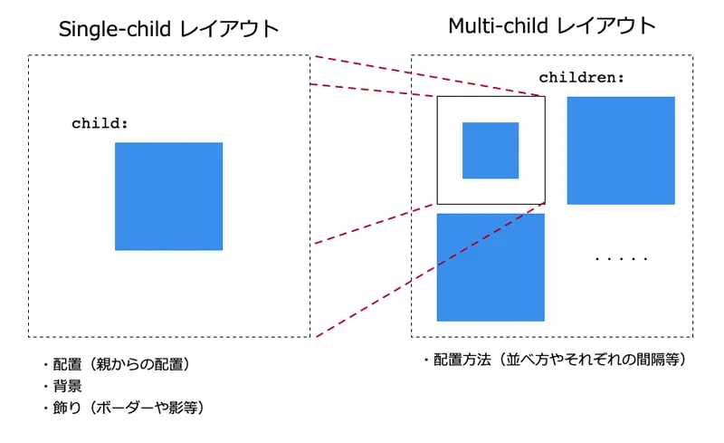(図1:Single-childとMulti-child layout Widgetsの役割の違い)

- 実際に利用する際には、必ずしもこのような明確な使い分けができない場合もある
- しかし、おおよその役割が分かれていることで、複雑なレイアウトの場合にも直感的なコードが書きやすくなるというメリットがある
# 主な単一のためのレイアウトウィジェット
(Single-child layout Widget)
単一のためのレイアウトウィジェットには、主に下記のようなものがある
- Container
  - Single-child layout Widgetの基本ウィジェット
- Align
  - 位置揃えをするためのウィジェット
- AspectRatio
  - サイズを比率で決定するためのウィジェット
- Baseline
  - テキストなどのベースラインによる位置揃えをするためのウィジェット
- Center
  - 中央に位置揃えをするためのウィジェット
- ConstrainedBox
  - 子ウィジェットに制限を強制するためのウィジェット
- Expanded
  - サイズを自動的に親ウィジェットに合わせて広げるウィジェット
- LimitedBox
  - サイズの最大を制限するためのウィジェット
- Offstage/今は`Visibilyty`
  - 子ウィジェットの表示／非表示を切り替えることができるウィジェット
- Padding
  - 余白を指定するウィジェット
- SizedBox
  - サイズを指定するウィジェット
- SizedOverflowBox
  - 指定する子ウィジェットのサイズを自分自身のサイズを超過して表示することを許可するウィジェット
- Transform
  - 子ウィジェットを回転や傾きなどをさせて表示するウィジェット
## Container（単一レイアウトの基本形）
- Containerウィジェットは、これらのウィジェットの基本となるウィジェット
- Containerでできることが分かれば、他のSingle-childレイアウトウィジェットについて理解する上でも必要なウィジェット
>Containerウィジェットのみを使った、基本的なプロパティの役割が分かるようにしたコード例
>［リスト1］Containerの基本プロパティ（lib/ContainerWidget.dartの抜粋）
```dart
Container basicContainer(){
  return Container(
    // （1） サイズと色を指定
    width: 350,
    height: 350,
    color: Colors.green,
    // （2） 子のContainer
    child: Container(
      child: Container( color: Colors.white ),
      // （3） サイズと色を指定
      color: Colors.blue,
      width: 300,
      height: 300,
      // （4） パディングを指定
      padding: EdgeInsets.all(30),
      // （5） マージンを指定
      margin: EdgeInsets.all(50),
      // （6） 配置場所を指定
      alignment: Alignment.center,
    ));
}
```
1. （1）のようにwidth／heightでサイズを指定します。
   1. 背景色はcolorプロパティで指定します。
   2. このContainerウィジェットは図2での緑色の短形を示しています。
2. （2）のContainerが図2で青色の短形を示し、
3. （3）で同様にwidth／height、colorを指定しています。
4. また、パディングとマージンを指定する場合には、（4）や（5）のように指定します。
5. 位置を指定する場合には、（6）のようにalignmentを利用します。
このコードを実行した結果が図2です。
ただし、サイズの関係がわかりやすいように説明を加えてあります。

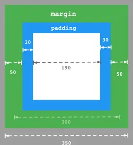(図2:Containerウィジェットを利用したコードの実行結果とその説明)

- プロパティ名などは違いますが、HTMLでのCSSなどをご存じの方であれば、おおよそイメージはつきやすいのではないかと思います。
### パディング(余白)/マージン値の指定方法
- 通常、余白値やマージン値を指定する場合には、EdgeInsetsを使って指定します。
- 先ほどの例ではパディングやマージンを指定する際に上下左右ですべて同じ値を設定していましたが、リスト2のように個別に指定することも可能です。
>［リスト2］値の作成例（lib/ContainerWidget.dartの抜粋）
```dart
return Container(
  // （省略）
  child: Container(
    // （省略）
    padding: createPadding(),
    margin: createMargin(),
  ));

// （1） 上下右左を個別に指定する
EdgeInsets createMargin(){
  return EdgeInsets.only(
    left: 10.0,
    top: 20.0,
    right: 30.0,
    bottom: 40.0
  );
}

// （2） 上下（vertical）と左右（horizontal）を指定する
EdgeInsets createPadding(){
  return EdgeInsets.symmetric(
    vertical: 10.0,
    horizontal: 20.0
  );
}
```
- 上下左右を個別に指定する場合には（1）のようにonlyメソッドを使います。
- そして、上下、または左右で同じ値を指定したければsymmetricメソッドで指定が可能です。
- これらのメソッドでは必要ない場所の指定はする必要ありません。
### 飾りをつける
- Containerウィジェットにはボーダーや影などもつけることが可能です。
- Containerにボーダーや影などの飾りをつける場合には、decorationプロパティを利用します。
>ボーダーを指定する場合のコード例
>［リスト3］Containerウィジェットでのボーダー指定例（lib/ContainerWidget.dartの抜粋）
```dart
Container borderContainer() {
  return Container(
    child: Text("Hello"),
    // （1） 色の指定はできません
    // color : Colors.white,
    width: 300,
    height: 300,
    alignment: Alignment.center,
    // （2） 飾りをつける
    decoration: BoxDecoration(
      color: Colors.white,
      border: Border.all(width: 15.0, color: Colors.blue)));
  }
```
- decorationを指定する場合には、（1）のようにcolorプロパティは利用できず、decorationプロパティ側で指定します。
- ボーダーを指定する場合には、（2）のようにBoxDecorationクラスを利用して作成します。
>このコードを実行した結果が図3のようになります。
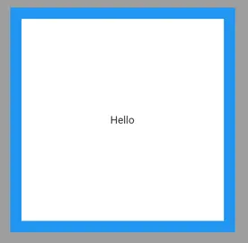(図3:Containerウィジェットへのボーダー指定時の実行結果)

>ボーダーに丸みと影をつけるコードがリスト4です。
>［リスト4］Containerウィジェットの角を丸めたり、影を付与したりする例（lib/ContainerWidget.dartの抜粋）
```dart
return BoxDecoration(
  color: Colors.white,
  border: Border.all(
    width: 5.0,
    color: Colors.blue
  ),
  // （1） 角を丸める効果
  borderRadius: BorderRadius.circular(50),
  // （2） 影をつける効果
  boxShadow: [
    BoxShadow(
      blurRadius: 20
    )
  ]
);
```
1. （1）は、BorderRadiusを使って指定していします。
2. そして、影をつける場合には、（2）のようにboxShadowプロパティにBoxShadowクラスを使うと簡単に作成可能です。
   1. このコードを実行した結果が図4のようになります。
  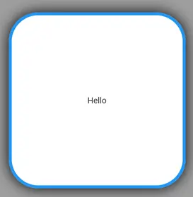
  (Containerウィジェットのボーダーの角丸や影を利用したコードの実行結果)
- このようにContainerウィジェットだけでもさまざまなことが可能です。
- ただし、プロパティが多くなり多少、コードがわかりにくくなる傾向があります。
## Centerウィジェット/Alignウィジェット
- Containerウィジェットの用途をより限定したCenterウィジェットやAlignウィジェットなどがあります。
- Centerウィジェットは、簡単にウィジェットを中央に配置するためのレイアウトで、リスト5のように利用します。

>［リスト5］Centerウィジェットでの利用例（lib/CenterWidget.dartの抜粋）
```dart
return Center(
  child: Container(
    color: Colors.deepOrange,
    width: 200,
    height: 200,
    margin: EdgeInsets.all(20),
  ),
);
```
このコードを実行した結果が、図5です。
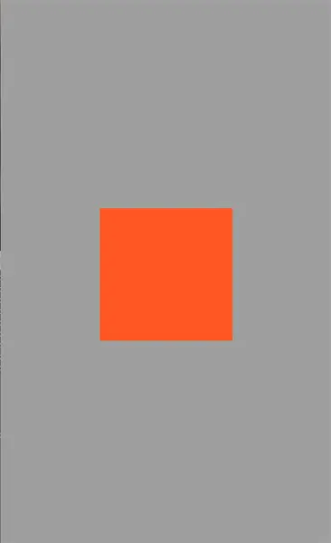
(図5:Centerウィジェットの実行結果)

- Alignウィジェットは、alignmentプロパティで指定して配置するためのウィジェットで、リスト6のように利用します。

>［リスト6］Alignウィジェットでの利用例（lib/AlignWidget.dartの抜粋）
```dart
return Align(
  alignment: Alignment.topRight,
  child: Container(
    width: 200,
    height: 200,
  color: Colors.blue,
  ),
);
```
このコードを実行した結果が、図6です。
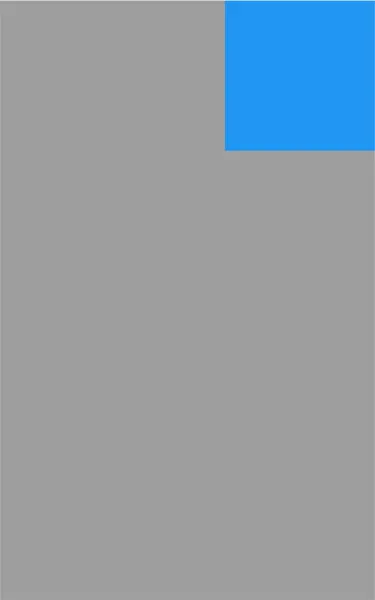
図6:Alignウィジェットの実行結果

このようにContainerウィジェットでも実現可能ですが、目的がはっきりとするためコードの目的にそってわかりやすくなるという特徴があります。

## AspectRatioウィジェット（サイズを比率で指定する）
- CenterウィジェットやAlignウィジェットなどはContainerウィジェットの機能を限定したような使い方になります。
  - しかし、Containerウィジェットのプロパティ指定だけでは難しいこともあります。
- そのようなウィジェットの1つに、AspectRatioウィジェットがあります。
- 親ウィジェットのサイズに応じてサイズ比率を決定するためのウィジェットです。

>例えば、リスト7は親ウィジェットの大きさに合わせて、16（横）：9（縦）の比率でサイズを指定したい場合のコード例です。
>［リスト7］AspectRatioウィジェットの利用例（lib/AspectRatioWidget.dartの抜粋）
```dart
return AspectRatio(
  // （1） 16/9で指定
  aspectRatio: 16/9,
  child: Container(
    margin: EdgeInsets.all(20),
    color: Colors.blue,
  ),
);
```
- （1）のように、aspectRatioプロパティに16:9の場合には16/9で指定します。
- 計算結果である約1.7のような値を入れるとどのような意図かわかりにくくなるので、16/9のように比率で入力することが推奨されています。

>このコードを実行した結果が図7のようになります。
>図7:AspectRatioを利用したコードの実行結果
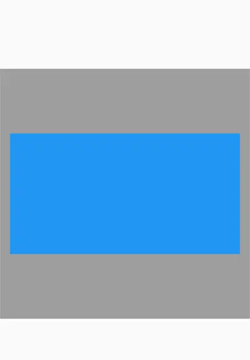
# 主なMulti-child layout Widgets
複数の子ウィジェットを配置するレイアウトを紹介
これらの主なレイアウトには主に表2のようなものがある
- Column	
  - ウィジェットを縦に並べるレイアウト
- Row
  - ウィジェットを横に並べるレイアウト
- GridView
  - ウィジェットを縦横に並べるレイアウト
- IndexedStack
  - 指定するウィジェットに表示を簡単に切り替えるためのレイアウト
- ListView
  - スクロールすることを想定し、ウィジェットを縦にリスト形式で並べるレイアウト
- Stack
  - ウィジェットを重ねて表示するためのレイアウト
- Table
  - ウィジェットを縦横に並べ、かつスクロール表示が必要ないためのレイアウト
- Wrap
  - ウィジェットを縦または横に並べ、はみ出したものは自動的に次の行または列に表示するレイアウト
## Column／Row（子ウィジェットを縦／横並びにそろえて配置する）
- 最も基本的なレイアウトウィジェットである`Column`と`Row`
- この2つは指定した子ウィジェットを縦もしくは横に並べる
- おおよそ、同じような使い方だが、それぞれのウィジェットをどのように並べるかの指定で注意が必要
- 並べ方には、下記の2つのプロパティがある
  - `mainAxisAlignment`
    - 子ウィジェットをどのように配置するか
  - `crossAxisAlignment`
    - 各ウィジェット間での位置揃えを設定
- ColumnとRowでは、この2つのプロパティの意味合いが変化する
- 以下の図を確認
### Column／RowとmainAxisAlignment／crossAxisAlignmentの対応
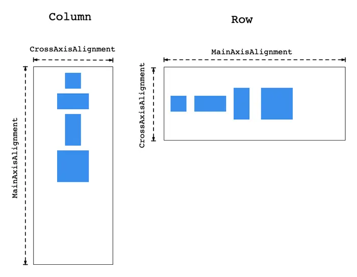

- Columnの場合には、`mainAxisAlignment`の違いによって図9のように配置が変わる
  - start／end／centerの違いはわかりやすい
- `spaceBetween`は各要素間の間隔を同じにする
- `spaceEvenly`は、両側のウィジェットと親要素の間隔も含めて同じにする
- `spaceAround`は、両側のみの間隔のみ1/2にする。
### ColumnでのmainAxisAlignmentの指定の違い
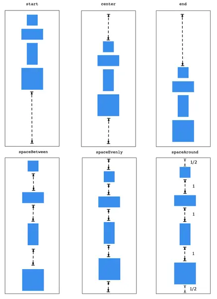

- 一方、crossAxisAlignmentの指定の違いを示したものが図10です
### ColumnでのcrossAxisAlignmentの指定の違い
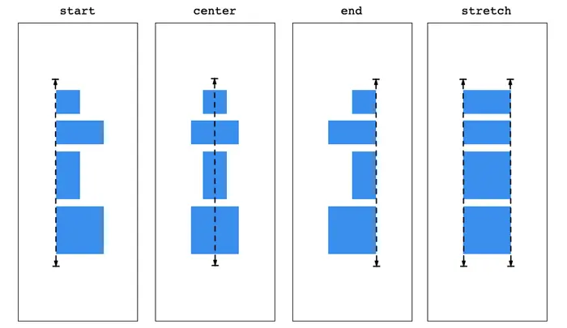

- start／end／centerでは子要素をどこで位置揃えをするかを決めます。また、stretchでは、最も大きい要素に合わせてサイズを調整します。実際のコードはリスト8のように記述します。

>［リスト8］Columnウィジェットの利用例（lib/ColumnWidget.dartの抜粋）
```dart
return Column(
  mainAxisAlignment: MainAxisAlignment.center,
    crossAxisAlignment: CrossAxisAlignment.start,
    children: [
      childContainer(100, 100),
      childContainer(200, 100),
      childContainer(100, 200),
      childContainer(200, 200),
    ],
);
```
>このコードを実行した結果が、図11のようになります。
>図11:Columnでのコード実行例
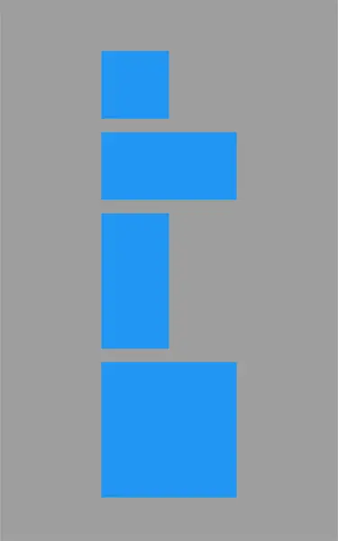

Rowでもほぼコードは変わらず、リスト9のように使用します。
>［リスト9］Rowウィジェットの利用例（lib/RowWidget.dartの抜粋）
```dart
return Row(
  mainAxisAlignment: MainAxisAlignment.center,
  crossAxisAlignment: CrossAxisAlignment.start,
  children: [
    childContainer(50, 50),
    childContainer(100, 50),
    childContainer(50, 100),
    childContainer(100, 100),
  ],
);
```
>このコードを実行した結果が、図12のようになります。
>図12:Rowでのコード実行例
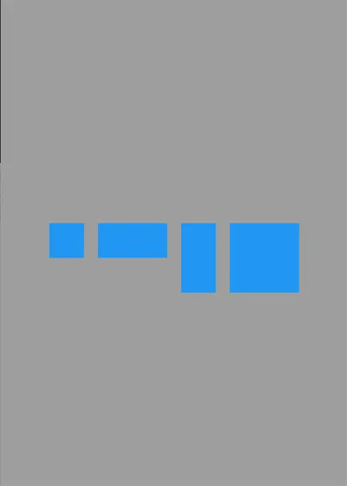

このようにmainAxisAlignmentとcrossAxisAlignmentのプロパティは同じですが、ColumnとRowでは向きが変わります。
# Wrap（はみ出すウィジェットを自動調整するウィジェット）
- ColumnやRowでは、子ウィジェットが多くなってしまったときにはみ出してしまうケースがあります。
- そのような場合に、自動的に調整するウィジェットがWrapウィジェットです。
- 例えば、親となるウィジェットや画面サイズがコード記述時にはわからなく、実行時にしか決まらないという場合があります。
- そのような場合には、表示する場所を図のようにはみ出さずに下に描画してほしいということがよくあります。

図13:Wrapが必要なケース
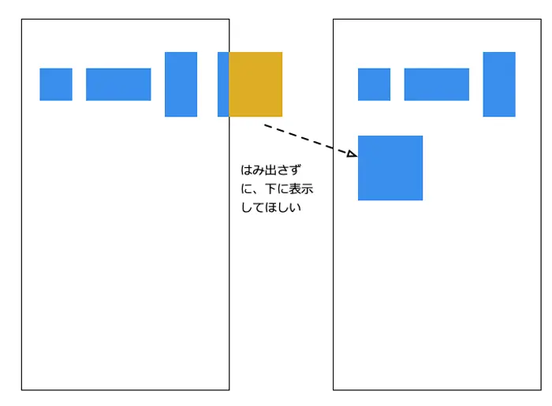

>リスト10は実際のWrapを使ったコード例です。
>［リスト10］Wrapウィジェットの利用例（lib/WrapWidget.dartの抜粋）
```dart
var colors = [Colors.red, Colors.blue, Colors.green, Colors.amber];
return Wrap(
  // （1） 並べる方向
  direction: Axis.horizontal,
  // （2） 次のウィジェット(この場合には横)との間隔
  spacing: 10,
  // （3） この場合には縦方向の間隔
  runSpacing: 40,
  children: [
    for(var i = 0; i < 4; i++)
      for(Color color in colors)
        childContainer(color)
    ],
);
```
1. （1）は、並べる方向になります。horizontalでは、横に並べていき、はみ出したときに下にずれるようになります。
   1. この値をverticalにすれば、縦に並べていきはみ出したときに、横にずれるようになります。
2. そして、spacingが隣のウィジェットとの間隔になります。
   1. 今回横方向に描写していっているので、横の間隔になります。
3. （3）runSpacingが今回の場合には縦方向の間隔になります。
   1. 似たようなウィジェットにGridViewというのもあります。


