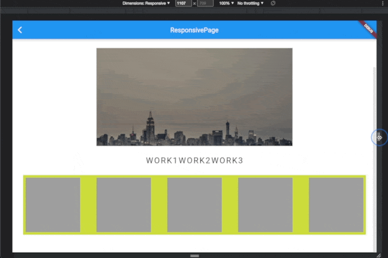

# ResponsiveGridView(ResponsiveFramework)
>https://pub.dev/documentation/responsive_framework/latest/responsive_grid/ResponsiveGridView-class.html
- グリッドアイテム間の幅などを考慮してサイズに応じていい感じにグリッド表示してくれる
- ResponsiveGridDelegateはSliverを継承
- 追加のカスタマイズパラメータalignmentとmaxRowCountは、アイテムの整列と行内のアイテム制限の機能を追加します。
```dart
ResponsiveGridView.builder(
  itemCount: _items.length,
  padding: const EdgeInsets.all(8.0),
  shrinkWrap: true,
  gridDelegate: const ResponsiveGridDelegate(
    crossAxisSpacing: 50,
    mainAxisSpacing: 50,
    minCrossAxisExtent: 150),
    itemBuilder: (BuildContext context, int index) =>
        Container(color: Colors.grey),
),
```
>ResponsiveBreakpoint での切り替えは一旦なしでデフォルトの Resize の動作

>スクロールするViewの最大高が未設定なので、shrinkWrap を true に設定しておく必要がある

