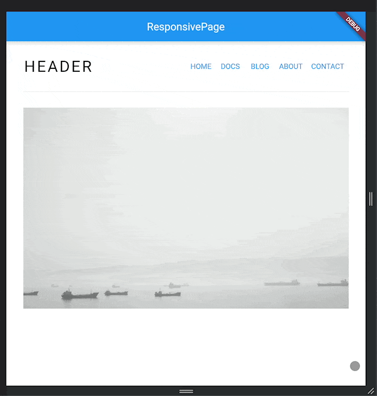
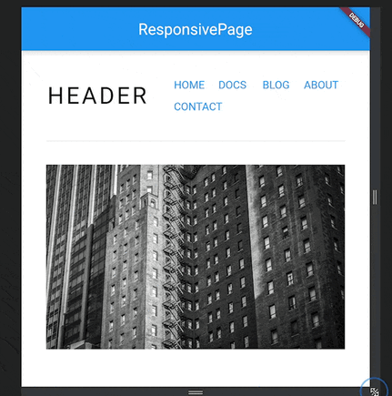
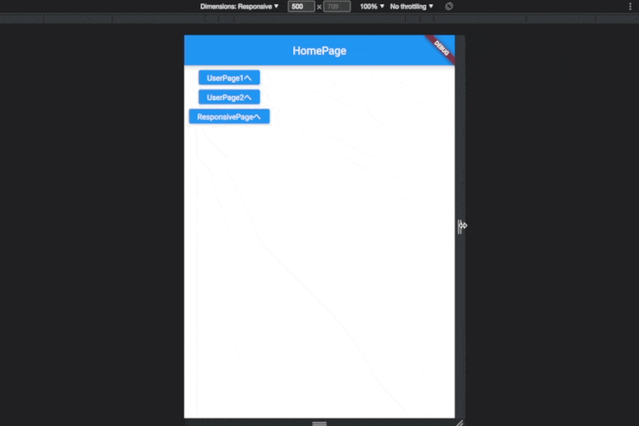
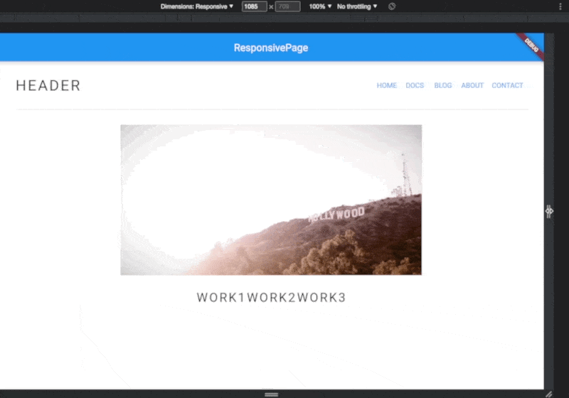
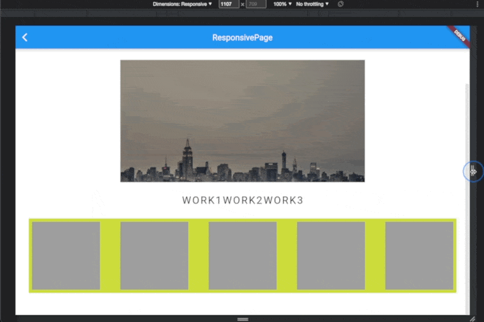
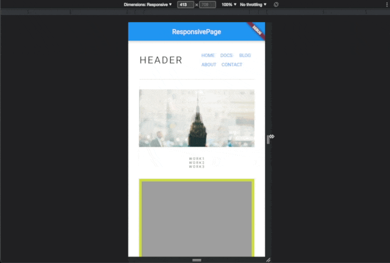

# レスポンシブ・フレームワーク
- レスポンシブフレームワークは、さまざまなスクリーンサイズにUIを自動的に適応させます。
- 一度作成したUIは、モバイル、タブレット、デスクトップでピクセル単位で完璧に表示されます。
- [レスポンシブ・フレームワーク](#レスポンシブフレームワーク)
  - [install](#install)
- [設定](#設定)
  - [AutoScale](#Autoscale)
  - [Breakpoints](#breakpoints)
- [レスポンシブ・レイアウト](#レスポンシブレイアウト)
  - [ResponsiveRowColumn](#responsiverowcolumn)
  - [ResponsiveGridView](#responsivegridview)
  - [ResponsiveValue](#responsivevalue)
  - [Tips](#tips)
    - [レスポンシブ対応のテキストスタイルを生成](#レスポンシブ対応のテキストスタイルを生成)
  - [入門のコンセプト](#入門のコンセプト)
>https://zenn.dev/slowhand/articles/d70ebdaea55af7
>https://resocoder.com/2021/10/03/create-responsive-flutter-apps-with-minimal-effort/
## install
1. run command
    ```bash
    flutter pub add responsive_framework
    ```
2. Dartのコードにインポート:
    ```dart
    import 'package:responsive_framework/responsive_framework.dart';
    ```
3. `ResponsiveWrapper.builder`をMaterialAppまたはCupertinoAppに追加
```dart
class MyApp extends StatelessWidget {
  @override
  Widget build(BuildContext context) {
    return MaterialApp(
      builder: (context, child) => ResponsiveWrapper.builder(
          child,
          maxWidth: 1200,
          minWidth: 480,
          defaultScale: true,
          breakpoints: [
            const ResponsiveBreakpoint.resize(480, name: MOBILE),
            const ResponsiveBreakpoint.autoScale(800, name: TABLET),
            const ResponsiveBreakpoint.resize(1000, name: DESKTOP),
            const ResponsiveBreakpoint.autoScale(1200, name: DESKTOP),
            const ResponsiveBreakpoint.autoScale(2460, name: '4K'),
          ],
          background: Container(color: Color(0xFFF5F5F5))),
      initialRoute: "/",
    );
  }
}
```
# 設定
## AutoScale 
AutoScaleは、レイアウトを均等に縮小・拡大し、UIの外観を正確に保持します。
Flutterはデフォルトで拡大・縮小した場合UIをリサイズする挙動になっています。
例えば AppBar の幅は double.infinity なので、スクリーンがどれだけ大きくなっても、利用可能な幅を満たすように引き伸ばされます。
このため、モバイル、タブレット、デスクトップにレイアウトを手動で適応させる必要がありません。
```dart
ResponsiveBreakpoint.autoScale(600);
```
Flutterのデフォルトの動作はリサイズで、Responsive Frameworkはこれを尊重します。
AutoScaleはデフォルトではオフになっており、ブレークポイントでautoScaleをtrueに設定することで有効にすることができます。

```dart
Widget build(BuildContext context) {
  return MaterialApp(
    title: 'Flutter Demo',
    theme: ThemeData(
    primarySwatch: Colors.blue,
  ),
  builder: (context, child) =>
    ResponsiveWrapper.builder(child, defaultScale: true), // ←追加
    home: const ResponsivePage(),
);
```
こうする事で↓の様に拡大・縮小にあわせてそのままのレイアウトで拡大・縮小しているのが分かるかと思います。

## Breakpoints 
ブレイクポイントは、異なるスクリーンサイズでのレスポンシブな動作を制御します。
```dart
ResponsiveWrapper(
    child,
    breakpoints: [
        ResponsiveBreakpoint.resize(600, name: MOBILE),
        ResponsiveBreakpoint.autoScale(800, name: TABLET),
        ResponsiveBreakpoint.autoScale(1200, name: DESKTOP),
    ],
)
```
ブレークポイントを使用すると、UIの表示方法を細かく制御することができます。
↓実際の挙動がこちらになります。

AutoScale の使いどころとして MOBILE と DESKTOP の間 (=TABLET) やより大きい画面の時にスケールさせると望ましい表示になるらしいです。
※ MOBILE や DESKTOP の名前は responsive_framework 内で定義されているもので、カスタム名を設定する事もできます。
# レスポンシブ・レイアウト
## ResponsiveRowColumn
- `Responsive Row/Column`という専用のレイアウトウィジェット
- サイズに応じて`Row / Column`を切り替えてくれるウィジェット
- 三項演算子を使って、画面サイズに応じて動的にレイアウトの引数を設定しています。
  - これは、現在の幅がDESKTOPブレイクポイント（800px）よりも小さいかどうかを確認し、小さい場合はレイアウト引数を`ResponsiveRowColumnType.COLUMN`に設定することで行っています。
  - 代わりに現在の幅が800px以上であれば、レイアウトは`ResponsiveRowColumnType.ROW`に設定されます。
```dart
ResponsiveRowColumn(
  rowMainAxisAlignment: MainAxisAlignment.center,
  rowPadding: const EdgeInsets.all(30),
  columnPadding: const EdgeInsets.all(30),
  layout: ResponsiveWrapper.of(context).isSmallerThan(DESKTOP)
    ? ResponsiveRowColumnType.COLUMN
    : ResponsiveRowColumnType.ROW,
  children: const [
    ResponsiveRowColumnItem(
      rowFlex: 1,
      child: Text('WORK1'),
    ),
    ResponsiveRowColumnItem(
      rowFlex: 1,
      child: Text('WORK2'),
    ),
```
WORK1, WORK2, のレイアウトを、DESKTOP よりも小さい場合は COLUMN レイアウトで、大きい場合は ROW レイアウトで表示するように設定
>↓実際に動作させてみるとレイアウトが変化している

## ResponsiveGridView
>https://pub.dev/documentation/responsive_framework/latest/responsive_grid/ResponsiveGridView-class.html
- グリッドアイテム間の幅などを考慮してサイズに応じていい感じにグリッド表示してくれる
- ResponsiveGridDelegateはSliverを継承
- 追加のカスタマイズパラメータalignmentとmaxRowCountは、アイテムの整列と行内のアイテム制限の機能を追加します。
```dart
ResponsiveGridView.builder(
  itemCount: _items.length,
  padding: const EdgeInsets.all(8.0),
  shrinkWrap: true,
  gridDelegate: const ResponsiveGridDelegate(
    crossAxisSpacing: 50,
    mainAxisSpacing: 50,
    minCrossAxisExtent: 150),
    itemBuilder: (BuildContext context, int index) =>
        Container(color: Colors.grey),
),
```
>ResponsiveBreakpoint での切り替えは一旦なしでデフォルトの Resize の動作

>スクロールするViewの最大高が未設定なので、shrinkWrap を true に設定しておく必要がある
## ResponsiveValue
- `ResponsiveValue` はサイズに応じて値を切り替える事ができます。

試しにサイズ毎に異なるフォントサイズを設定してみたいと思います。
先ほど`ResponsiveRowColumn`での`DefaultTextStyle`を使って設定してみます。
```dart
TextStyle(
  color: Colors.black,
  fontSize: ResponsiveValue( // ← 追加
  context,
  defaultValue: 25.0,
  valueWhen: const [
    Condition.smallerThan(name: MOBILE, value: 10.0),
    Condition.largerThan(name: TABLET, value: 40.0)
  ],
).value
```
>↑ `Condition.smallerThan(name: MOBILE, value: 10.0)`で`MOBILE`より小さい場合はフォントサイズが 10.0 になる様に
`Condition.largerThan(name: TABLET, value: 40.0)`で`TABLET`より大きい場合はフォントサイズが 40.0 になるように設定

## Tips
### レスポンシブ対応のテキストスタイルを生成
```dart
///レスポンシブ対応のテキストスタイルを生成
TextStyle genResponsiveTextStyle(
    BuildContext context,
    double mobileValue,
    double tabletValue,
    double? letterSpacing,
    FontWeight? fontWeight,
    Color? color) {
  final value = ResponsiveValue(
    context,
    defaultValue: 25.0,
    valueWhen: [
      //MOBILE より小さい場合はフォントサイズがvalue  になる
      Condition.smallerThan(name: MOBILE, value: mobileValue),
      // TABLET より大きい場合はフォントサイズが value になる
      Condition.largerThan(name: TABLET, value: tabletValue)
    ],
  ).value;
  return TextStyle(
      color: color,
      fontSize: value,
      letterSpacing: letterSpacing,
      fontWeight: fontWeight);
}
```

## 入門のコンセプト
これらのコンセプトは、Responsive Frameworkの使用を開始し、レスポンシブなアプリを迅速に構築するのに役立ちます。

スケールとリサイズ
Flutterのデフォルトの動作は、画面の寸法が変化したときにレイアウトをリサイズすることです。レイアウトのリサイズは、制約のない幅や高さの方向に引き伸ばされます。制約のある寸法は固定されたままなので、モバイルアプリのUIがデスクトップで小さく見えるのはそのためです。次の例は、リサイズとスケーリングの違いを示しています。

スクリーンショット

AppBarウィジェットは、携帯電話では正しく表示されています。しかし、デスクトップで見ると、AppBarは短すぎ、タイトルは小さすぎるように見えます。それぞれの動作について説明します。

リサイズ（デフォルト） - AppBarの幅はdouble.infinityであるため、利用可能な幅を埋めるように引き伸ばされます。ツールバーの高さは固定で、56dpのままです。
スケーリング - AppBarの幅は、利用可能な幅を埋めるために引き伸ばされます。高さは、最も近いResponsiveBreakpointから自動的に計算されたアスペクト比を使用して、比例して拡大縮小します。幅が大きくなると、高さも比例して大きくなります。
拡大縮小されたAppBarは、あるサイズまでならデスクトップでも正しく表示されます。画面が広くなりすぎると、AppBarは大きく表示されるようになります。そこで、ブレークポイントの出番となる。

ブレークポイントの設定
さまざまな画面サイズに対応するために、ブレークポイントを設定して、レスポンシブな動作を制御します。

任意の数のブレークポイントを設定できます。リサイズ・スケーリング動作を混在させることができる。

480 以下: 小さな画面では、窮屈さやオーバーフローエラーを避けるためにリサイズされます。
480-800：携帯電話では、ネイティブ・ウィジェットサイズにリサイズされます。
800-1000: タブレットでは、要素が小さく表示されるのを防ぐため、サイズを変更します。
1000以上：デスクトップでは、利用可能なスペースを使用するためにサイズを変更します。
2460+: 4Kの超大型ディスプレイでは、テキストが読みやすく、ウィジェットの間隔が広くなりすぎないようにスケーリングします。

