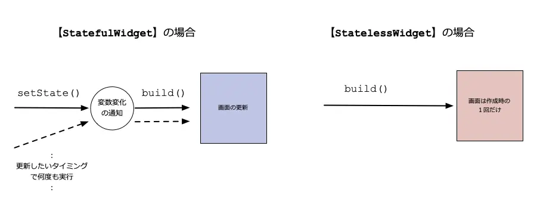
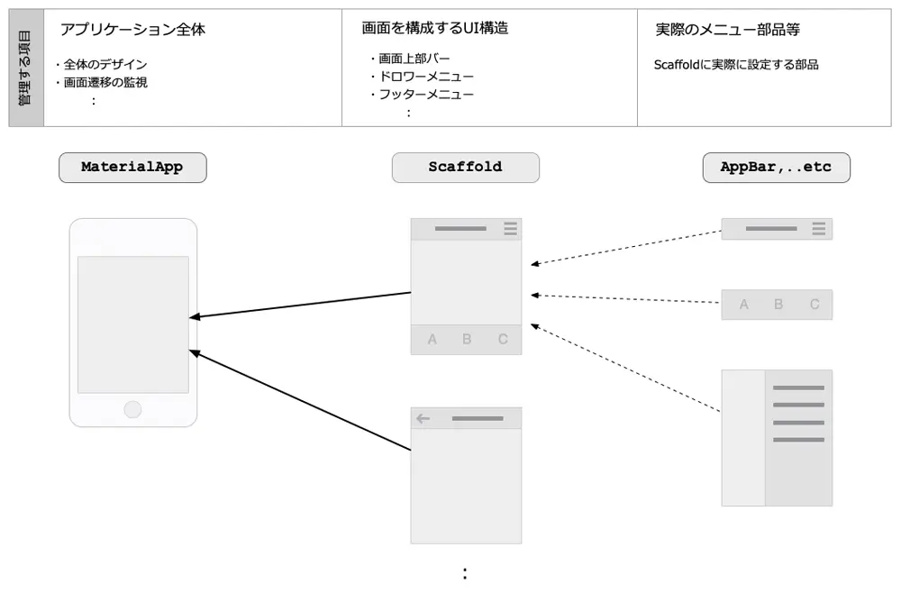
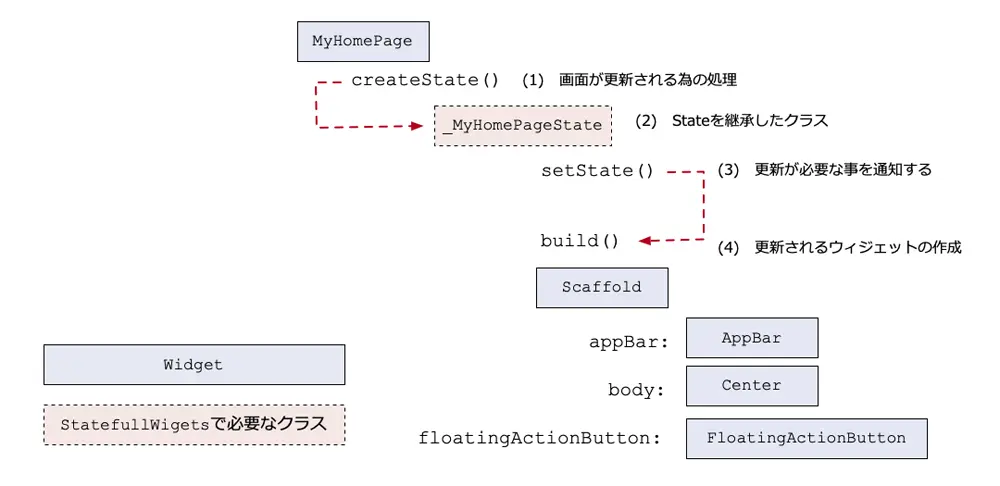

# FlutterでUIを扱う時の基本的な概念
- Flutterでは以下の2つの管理を行えば、実際の画面更新はフレームワーク側で自動的に行われる仕組み
  - 画面を更新する部品の定義と、更新しない部品の定義
  - 画面の更新が必要なタイミングの明示的な通知
- Flutterでは、この画面更新するタイミング管理を「ステート（State）」と呼んでいます。
- 従って、プログラマーはこの「ステート」を意識してプログラミングをする必要があります。
## ステートフルウィジェットとステートレスウィジェット
- いずれのUI部品もこのどちらかに所属します。
  - 「ステート」を管理する必要があることを「ステートフル」
  - 管理する必要がないことを「ステートレス」
- また、UI部品を「ウィジェット（Widget）」と呼んでいるので、これらの基底となるUI部品は2つに分けられます。
  - 「ステートフルウィジェット（StatefulWidget）」
    - setState()というメソッドを通じてフレームワーク側に画面更新が必要であることを通知します。
    - あとは、フレームワーク側でbuild()メソッドが実行されるので、プログラマーは必要な画面表示処理をbuild()メソッド内に実装します
  - 「ステートレスウィジェット（StatelessWidget）」
    - インスタンスの作成時に画面表示処理であるbuild()メソッドが実行されます。その後にその表示を更新するタイミングはありません
    - つまり、StatelessWidgetの表示内容を変更するためには、再作成が必要です。
    - 通常は初回表示時と親部品が更新されるタイミングで再作成されます。
- 自分でUI部品を作成する場合には、このいずれかのクラスを継承する必要があります。そして、それぞれの画面制御をする流れが図2のようになります。
>図2：StatefulWidgetとStatelessWidgetでの画面制御の違い

## Flutterでの基本部品
- 実際にアプリケーションを作成する際には多くの既存の部品を組み合わせて作成しますが、
- Flutterアプリでは、
  - アプリケーション全体管理するための「MaterialApp」
    - Flutterアプリケーションの全体を管理するもの
    - 主に全体のデザインや画面遷移をする場合の状態監視
    - アプリケーション全体のタイトルやその全体にかかわるプロパティの管理
    - CupertinoAppはライセンス上iosでのみ動作する
  - 画面全体を構成するための「Scaffold」
    - 「足場」という意味
    - モバイルアプリ画面を作る上でよく使われるメニュー表示方法を含めて画面全体を管理する
- という部品が用意されています。
- MaterialAppとScaffoldは非常に密接な関係であり図3のような関係があります。
>図3：MaterialAppとScaffoldの関係

### Scaffold
- 画面構成で解説
- モバイルアプリであればなじみ深い、下記のような部品を管理できます。
  - AppBar
    - 画面上部に表示するタイトルやアイコンなど
  - BottomNavigationBar
    - 画面の下部に表示するメニューボタンなど
  - Drawer
    - ドロワーメニュー。必要時に左もしくは右側から表示されるメニュー領域
  - BottomSheet
    - 画面下部から必要時に表示される領域
  - SnackBar
    - 画面下部などに表示する通知表示領域
  - FloatingActionButton
    - 画面下部などに表示するショートカットボタン
### プログラム構造
サンプルアプリケーションはFlutterでの基本的なプログラム構造を理解するための要素がつまっています。
>Flutterのサンプルプログラムのコード（lib/main.dartからの抜粋）
```dart
import 'package:flutter/material.dart';

//  （1） プログラムの開始
void main() {
  runApp(MyApp());
}

//  （2） アプリケーションを定義
class MyApp extends StatelessWidget {

  // （3） アプリケーション全体の作成
  Widget build(BuildContext context) {
    return MaterialApp(
      // （4） 初期画面のウィジェット
      home: MyHomePage(title: 'Flutter Demo Home Page'),
    );
  }
}
// （5） 画面の定義
class MyHomePage extends StatefulWidget {
  // （省略）
}
// （省略）
```

1. Flutterでは（1）のようにプログラムを開始するにはmain()を定義する必要があります。
2. そして、runAppで指定するアプリケーションを起動します。
   1. アプリケーションとして指定するMyAppも、（2）のようにウィジェットとして定義する必要があります。
3. そして、その中で前述したMaterialAppは（3）のようにさらに子ウィジェットとして作成しています。
4. また、StatelessWidgetの継承クラスなので、buildメソッドで画面作成を定義しています。

先ほどアプリケーション全体がMaterialAppであると説明しましたが、Flutterではアプリケーション全体であっても、1つのウィジェットとして管理する仕組みになっています。

5. そして、（4）のようにデフォルトの画面を定義するMaterialAppのhomeプロパティに（5）で定義するMyHomePageウィジェットを指定しています。
6. MyHomePageはStatefulWidgetを継承したクラスとして作成しているためにステートを管理するクラスになります。

>ステートを管理するには、このようにします。
>StatefulWidgetを定義するコード（lib/main.dartからの抜粋）
```dart
// （省略）
class MyHomePage extends StatefulWidget {
  // （省略）
  // （1） ステートを管理する部品の定義
  @override
  _MyHomePageState createState() => _MyHomePageState();
}
// （2） 更新が必要なことを通知する
class _MyHomePageState extends State {
  int _counter = 0;

  void _incrementCounter() {
    // （3） 更新が必要なことを通知する
    setState(() {
      _counter++;
    });
  }

  @override
  // （4） 更新されるウィジェットの作成
  Widget build(BuildContext context) {
    return Scaffold(
          appBar: AppBar(
            // （省略）
          ),
          body: Center(
            // （省略）
          ),
          floatingActionButton: FloatingActionButton(
            // （5） ボタンを押した時の処理
            onPressed: _incrementCounter,
            // （省略）
          ),
        );
  }
}
```
1. StatefulWidgetでは、buildメソッドで直接ウィジェットを作成しないかわりに、（1）のようにcreateStateメソッドを使って、
2. 状態の管理とその状態に依存する表示を定義するStateというクラスを継承したクラスを作成します（2）。

StatefulWidgetはStatelessWidgetに比べて多少面倒な処理が必要になります    
StatefulWidgetではわざわざ2つのクラスに分けて管理するにはFlutter内部での管理構造に理由があるのですが、ここではStatefulWidgetを継承してクラスを作る場合の流れだけ理解してもらえればまずは問題ありません。

3. Stateを継承したクラスでは、変数の値を変更する際には、（3）のようにsetStateメソッド内で処理を行います。
   1. このようにすることで、画面更新が必要になることをフレームワーク側に通知します。
4. そして、フレームワーク側では画面更新を行うためにbuildメソッド（4）を実行します。
5. そして、FloatingActionButtonというウィジェットが押された時には、_incrementCounterメソッドが実行され、（3）setStateを実行します。
6. すると再度buildメソッドが実行され、ウィジェットの作成から更新までがおこなれます。この構造と流れを図で示したものが図5です。
>図5：StatefulWidgetの構造と処理の流れ



