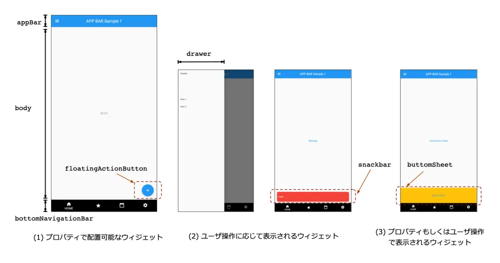
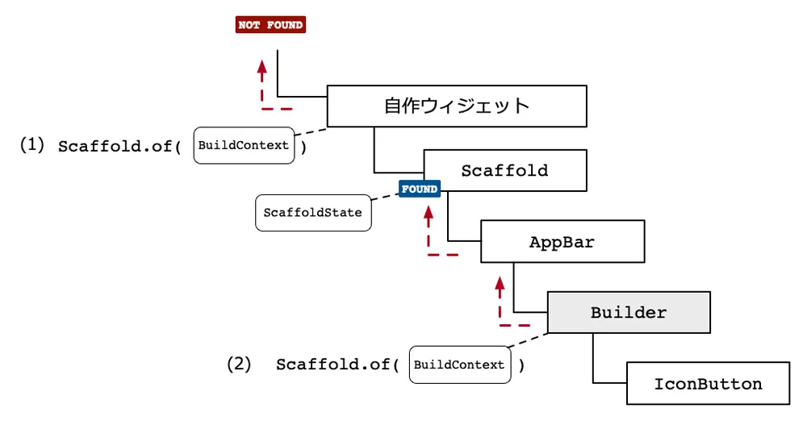
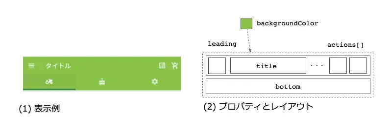
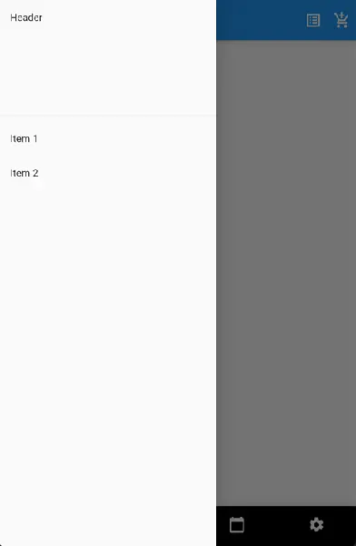
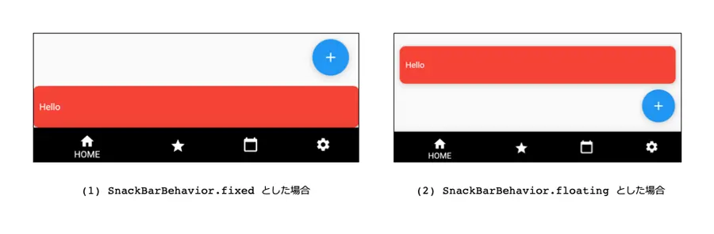
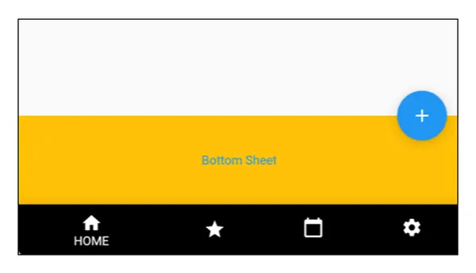

# Flutterアプリの画面構成
- [Flutterアプリの画面構成](#flutterアプリの画面構成)
- [flutterの標準画面構成を理解する](#flutterの標準画面構成を理解する)
    - [Scaffoldウィジェット解説とそれによる画面構成](#scaffoldウィジェット解説とそれによる画面構成)
      - [Scaffoldが管理できる主なUI部品](#scaffoldが管理できる主なui部品)
  - [BuilderとBuildContextとは](#builderとbuildcontextとは)
  - [AppBarウィジェット](#appbarウィジェット)
  - [FloatingActionButtonウィジェット](#floatingactionbuttonウィジェット)
  - [Drawerウィジェット](#drawerウィジェット)
  - [Drawerをプログラムからオープンする](#drawerをプログラムからオープンする)
  - [SnackBarウィジェット](#snackbarウィジェット)
  - [BottomSheetウィジェット](#bottomsheetウィジェット)

# flutterの標準画面構成を理解する
- 個々の画面を作っていく際の標準的な管理ウィジェットである、Scaffold関連のウィジェットについて中心に説明します。
### Scaffoldウィジェット解説とそれによる画面構成
>https://gakogako.com/flutter_scaffold/
- FlutterのUI構築は様々なWidgetをScaffoldからミルフィーユの様に積み重ねていって構築
- Scaffoldをスタート地点として、その上に数多の他のWidgetを配置していってUIを構築します。
- よく利用するようなものが用意されているので、最低限のコーディングで素早く典型的なモバイルアプリが作れます。
>Scaffoldウィジェットを使って生成できる画面要素を、以下の図にまとめます。

図1:Scaffoldと各ウィジェットとの関係
#### Scaffoldが管理できる主なUI部品
- [appBar](#appbarウィジェット)
  - `AppBar`	
  - 画面上部に表示するタイトルやアイコンなど
- body
  - 任意のウィジェット
  - メインとなる画面
- bottomNavigationBar
  - [`BottomNavigationBar`](../UI/Widget/メニューバー.md)
  - 画面の下部に表示するメニューボタンなど
- drawer/endDrawer
  - [`Drawer`](ハンバーガ.md)
  - ドロワーメニュー。必要時に左もしくは右側から表示されるメニュー領域。
    - ハンバーガメニューとも呼ぶ
  - 表示する際には`openDrawer/openEndDrawer`メソッドを使う。
- floatingActionButton
  - `FloatingActionButton`
  - 画面下部などに表示するショートカットボタン
- bottomSheet	
  - `BottomSheet`
  - 画面下部から必要時に表示される領域。
  - 通常は、必要時に表示するので、プロパティを使わずshowBottomSheetメソッドを使う。
- SnackBar
  - 画面下部などに表示する通知表示領域
 
これらのウィジェットを組み合わせつつ、また、カスタマイズすることで、モバイルアプリとして標準的な機能と画面構成を実現しつつ、望むデザインのアプリをすぐに作ることができます。
## BuilderとBuildContextとは
- Scaffold.ofメソッドを使ってうまく動くケースと、正しく動かないケースがあります。
- それは、多くの場合には指定する`BuildContext`が間違っているためです。
- `BuildContext`とは、ウィジェットを管理しているツリー構造の中で該当のウィジェットを管理するためのクラスで、図7のようなものをイメージしてください。
  >図7:ウィジェットと`BuildContext`の関係
  
- Scaffold.ofメソッドは、指定した`BuildContext`インスタンスを使って、親ウィジェットをたどってScaffoldウィジェットを探していく処理です。
- そのため、Scaffoldを作る際に使ったBuildContextを使う場合には、（1）のようになるため見つかりません。
- しかし、既存のウィジェットだけを使っていると、ソースコード上どこにもBuildContextが現れません。
- そこで、BuilderウィジェットはBuildContextインスタンスを取得するために利用されます。
- これで（2）のようにScaffoldウィジェットが見つかるという仕組みです。
- 
!!! warn! 実際にさまざまな処理を記述していくと、まったく同じコードを記述しているのに動く場合と動かない場合などがあります。その場合には今回の内容を思い出していただけると、問題解決する際にイメージしやすくなります。
##  AppBarウィジェット
- AppBarは、高さが固定のメニューです。
- スクロールしていくと高さが変わるメニューを作成することも可能で、その場合にはSilverAppBarというウィジェットを利用します。
- こちらのウィジェットの詳しい使い方は別で

>AppBarの表示例と各子ウィジェットを設定できる場所とプロパティ名の関係を示したものが図2です。
図2:AppBarの各プロパティと位置の関係


>これらのプロパティに実際に値を設定した例がリスト1です。
>［リスト1］ AppBarクラスの利用例（lib/pages/AppBarSample.dartの抜粋）
```dart
appBar: AppBar(
  //  （1） タイトルの指定
  title: Text("タイトル"),
  centerTitle: true,
  // （2） 背景色の指定
  backgroundColor: Colors.lightGreen,
  // （3） 左アイコン
  leading: IconButton(
    icon: Icon(Icons.menu),
    onPressed: (){},
  ),
  // （4） 右アイコン
  actions: [
    IconButton(icon: Icon(Icons.list_alt), onPressed: (){}),
    IconButton(icon: Icon(Icons.add_shopping_cart), onPressed: (){})
  ],
  //  （5） 下部の設定
  bottom: TabBar(
    //  省略
    tabs: [
      Tab(icon: Icon(Icons.agriculture_rounded)),
      Tab(icon: Icon(Icons.cake)),
      Tab(icon : Icon(Icons.settings))
    ],
  ),
)
```
1. （1）でタイトルを指定します。centerTitleでfalseを指定すると左よせに、trueで中央寄せになります。
2. （2）のbackgroundColorで背景色を変更します。そして、leadingプロパティでメニュー左のウィジェットを指定し、actionsプロパティで右側に配置するウィジェットを指定します。
3. ヘッダメニューでは一般的にアイコンを使ってメニューを作成すると思います。Flutterではあらかじめアイコンが用意されているので、こちらから選択することができます。
4. これらのアイコンを使うと簡単にメニューを作成可能です。また、アイコンのみのボタンを利用するには、IconButtonを使います。
   1. そしてボタンが押された時の処理はonPressedで指定した関数がコールバックされます。

簡単なヘッダメニューであれば、これで十分ですが、メニュー下部にもウィジェットを配置したい場合には、bottomプロパティを利用します。
- bottomプロパティには好きなウィジェットを配置できますが、一般的にはTabBarウィジェットがよく利用されます。
## FloatingActionButtonウィジェット
- 丸形のボタンを画面上に配置するためのウィジェットです。
- 例えば、上に戻るボタンや、新規作成ボタンをショートカット的な使い方で配置するボタンとしてよく利用されます。
- デフォルトでは画面右下に表示されますが、ScaffoldのfloatingActionButtonLocationプロパティを指定することで、実際にはさまざまな場所に配置することができます。
- 具体的な設置可能な配置場所はAPIドキュメントを参照してください。
- リスト3はScaffoldにFloatingActionButtonを追加する場合の実装例です。
>［リスト3］ FloatingActionButtonの利用例（lib/pages/ScaffoldSample.dartの抜粋）
```dart
floatingActionButton: FloatingActionButton(
  child: Icon(Icons.add),  // （1） 実際に表示するウィジェット
  tooltip: "追加する",      // （2） ツールチップ用の表示文字列
  onPressed: (){           // （3） ボタンが押された時の処理
  },
),
```
1. （1）で実際に表示するウィジェットを指定します。ここではアイコンを表示しています。
2. また、（2）のtooltipでツールチップ用の表示文字列を指定し、
3. （3）のonPressedではボタンが押された時の処理を記述します。

## Drawerウィジェット
- Drawerはスワイプで開閉することができるウィジェットです。
- 一般的にはメニューなどを表示します。
- Drawerは、右から開くDrawerと左から開くDrawerの2種類があります。
- 左から開く場合には、Scaffoldのdrawerプロパティを利用し、右から開く場合には、endDrawerプロパティを使用します。

>［リスト4］ Drawerの利用例（lib/pages/ScaffoldDrawer.dartの抜粋）
```dart
drawer: Drawer(
  child: ListView(
    children: [
      DrawerHeader(child: Text("Header")),
      ListTile(
        title: Text("Item 1"),
      ),
      ListTile(
        title: Text("Item 2"),
      )
    ],
  ),
),
```
このプログラムを実行した結果

>図4:Drawerの実行例
## Drawerをプログラムからオープンする
- Drawerはスワイプで表示可能ですが、プログラムで開きたい場合があります。
>［リスト4］ AppBarに配置したボタンからDrawerを開く場合の利用例（lib/pages/ScaffoldDrawer.dartの抜粋）
```dart
appBar: AppBar(
  // （1） Builderウィジェットを使う
  leading: Builder(
    builder: (context) => IconButton(
    icon: Icon(Icons.menu),
      onPressed: (){
        // （2） Drawerを開く処理
        Scaffold.of(context).openDrawer();
      })
  ),
  //  ( 省略 )
),
```
1. AppBarウィジェットでleadingプロパティには、（1）のように直接、IconButtonウィジェットを設定せずにBuilderウィジェットを設定しています。
   1. これは、onPressedメソッド内でBuildContextを利用したいためです
2. そして、（2）のように、openDrawerメソッドを使ってDrawerを開きます。
   1. endDrawerに設定しているDrawerを開きたい場合にはopenEndDrawerメソッドを使います。

## SnackBarウィジェット
　SnackBarは、画面下部にメッセージを一時的に表示するためのウィジェットです。表示したものは、時間が経過すると自動的に消えます。また、表示する位置は、behaviorプロパティにSnackBarBehaviorの値を指定することで変更できます。

図5:SnackBarの表示位置の違い

>実際に表示する場合のコードを示したもの
>［リスト5］ SnackBarウィジェットの利用例（lib/pages/ScaffoldSnackBar.dartの抜粋）
```dart
body: Center(
  child: TextButton(
    child: Text("Message"),
      onPressed: (){
        // （1） Snackbarを表示する
        ScaffoldMessenger.of(context).showSnackBar(
          // （2） SnackBarを作成
          SnackBar(
            // （3） 各プロパティの設定
            content: Text("Hello"),
            behavior: SnackBarBehavior.floating,
            duration: Duration(seconds: 5),
            // (省略)
          )
       );
     },
  )
),
```
1. Snackbarを表示する際には、（1）のようにScaffoldMessengerクラスのshowSnackBarメソッドを使います。
   1. Drawerを表示する場合には、Scaffold.ofメソッドを使いましたが、Snackbarの場合には、ScaffoldMessengerクラスを使います。
   2. これによって、Builderウィジェットを使わなくても問題なくなります。
2. （2）でSnackBarを作ります。
3. そして、（3）のように各プロパティを設定します。
   1. 実際に設定できる項目はAPIDoCを参照してください。

## BottomSheetウィジェット
- BottomSheetウィジェットは、図6のように画面下部により自由なUIを作りたい場合に使います。
- SnackBarと似ている部分もありますが、より自由なUIが作れ、メニュー表示などにも利用されます。
- 実際に表示する部品は、他のウィジェットのように、既定のウィジェットを使わず自由なウィジェットを利用します。


>図6:BottomSheetの表示例

>リスト6が実際のBottomSheetを表示する場合の実装例です。
［リスト6］ BottomSheetウィジェットの利用例（lib/pages/ScaffoldBottomSheet.dartの抜粋）
```dart
onPressed: (){
  // （1） 表示する処理
  Scaffold.of(context).showBottomSheet((BuildContext context) {
    return Container(
      height: 100,
      color: Colors.amber,
      child: Center(
        child: TextButton(
          child: Text("Bottom Sheet"),
          onPressed: (){
            // （2） 閉じる処理
            Navigator.pop(context);
          },
        ),
      ),
    );
  });
}
```
1. 実際に表示する場合には、（1）のようにshowBottomSheetメソッドを使って表示するウィジェットを作成します。
2. また、表示したウィジェットを閉じる場合には、（2）のようにNavigator.pop()を使います。
3. これは次回説明しますが、1つ前のページに戻る処理と同じになります。


