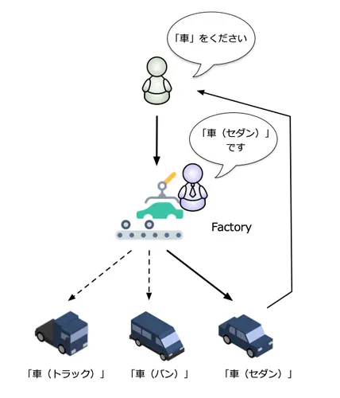
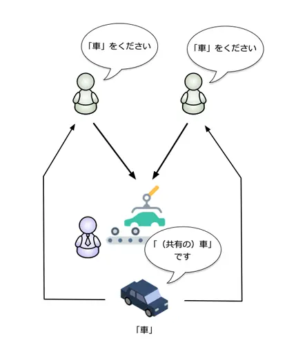
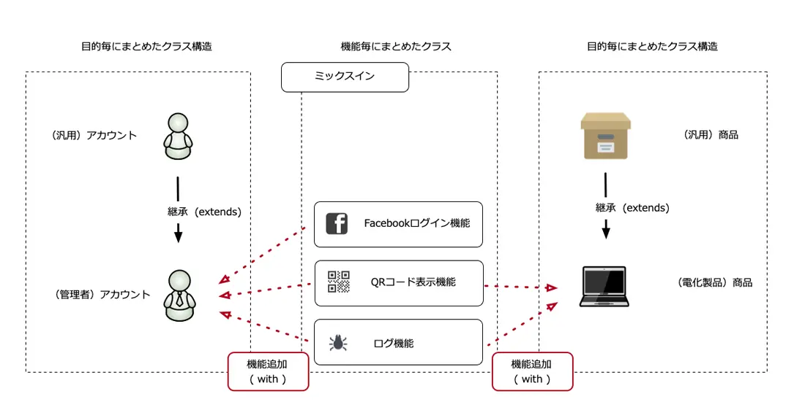

# Factoryコンストラクタ
前回、Dartにおけるコンストラクタの定義方法について紹介しました。
今回は、そこで紹介できなかったFactoryコンストラクタについて紹介します。
Factoryコンストラクタは、コンストラクタと言っても他のコンストラクタと大きく役割が異なります。

## Factoryコンストラクタの作り方
　Factoryコンストラクタの実装例がリスト1です。

>［リスト1］Factoryコンストラクタの使い方
（factory_default_class.dartの抜粋）
```dart
abstract class PasswordHash{
  //  （1）Factoryキーワードをつけたコンストラクタを用意する
  factory PasswordHash(){
    //  （2）インスタンスを作成してreturnする
    return DefaultHash();
  }
}
```
　Factoryコンストラクタを定義するには（1）のようにコンストラクタの前にFactoryキーワードを指定します。そして、実際のインスタンスを（2）のようにreturnで返します。このように、作り方は非常に簡単です。（2）で作成するインスタンスは必ずしも定義したクラスそのものである必要はありません。この仕組みを応用することで設計の自由度が広がります。

## 応用例（Factoryパターン）
- 先ほどのサンプルコードは、Factoryパターンというプログラミング手法を使ったコード例です。
- この「Factory」とは、日本語で言えば「工場」の意味を示しますが、プログラミングの世界では、図1のように呼び出し元が、具体的な実装クラスを意識せずに利用させるようにするものを「Factoryパターン」と呼びます。
- 実際の利用シーンでは、returnするインスタンスを作成する工程が複雑になることもあるため、Factory（工場）という用語が用いられています。
>［リスト2］Factoryコンストラクタを使った実装クラスの切り替え（factory_default_class.dart）
```dart
// （1） abstractクラスとして制限をかける
abstract class PasswordHash{
  factory PasswordHash(){
    return DefaultHash();
  }
  // 省略
}
// （2） 実装クラスを定義
class DefaultHash implements PasswordHash{
  // (省略)
}
main(){
  // （3） 利用者は DefaultHash というクラスの存在を知らなくてよい
  var hash = PasswordHash();
  hash.convert("pswd");
}
```
1. （1）でabstractとしてクラスを作成しているのは、このクラス自体が実装を持たないクラスであることを示すためです。
   1. abstractクラスはインスタンス化できません。そのため、通常は（3）のような使い方はできません。
   2. しかし、それを可能にしているのがFactoryコンストラクタです。
2. （2）では、実装クラスを定義しています。インターフェースをそろえる必要があるので、PasswordHashをインターフェースとして利用しています
   1. （extendsを利用した継承でもこのケースではほぼ同様ですが、今回はより制限をはっきりさせるためにimplementsを利用しています）。
3. （3）のようにPasswordHashをインスタンス化していますが、実際のインスタンスはDefaultHashクラスのインスタンスです。
   1. しかし、そのことを開発者が意識する必要がないのが、Factoryパターンのポイントです。
# singletonパターン
- もう1つの例として、singletonクラスの作成を紹介します。
- singletonパターンとは、図2の通り、1つしかインスタンスが生成されないことを保証するためのプログラミング手法です。
- 利用時にいくつものインスタンスを作成しても、実際にはインスタンスが他と共有されています。
- そのため、キャッシュ機能や共有データ、処理の効率化などいろいろなシーンで応用できるテクニックの1つです。

リスト3はsingletonパターンでFactoryコンストラクタを使った場合のコード例です。

>［リスト3］Factoryコンストラクタをシングルトンクラスの実装（factory_singleton_class.dart）
```dart
class Singleton{
  // （1） staticとしてインスタンスを事前に作成
  static final Singleton _instance = Singleton._internal();
  int _counter = 0;
  // （2） Factoryコンストラクタ
  factory Singleton(){
    return _instance;
  }
  // （3） 内部で利用する別名コンストラクタ
  Singleton._internal();

  int increment(){
    return ++_counter;
  }
}
main(){
  // （4） 利用するコード
  var inst1 = Singleton();
  var inst2 = Singleton();

  print(inst1.increment());  // 1となる
  print(inst2.increment());  // 2となる
}
```
1. （1）でstaticな変数としてインスタンスを作成します。
2. 実際にインスタンスを作成する際には、（3）の別名コンストラクタを用いて作成します。
3. 続いて（2）のコンストラクタでは、（1）で作成したインスタンスを返すようにします。
4. 実際に利用する場合、（4）のように複数のインスタンスを作成しているように見えても、実際のインスタンスは1つとして扱えます。
# ミックスイン
- Dartでは、単一継承の制限があります。
  - つまり、直接の親クラスは1つでなければなりません。
- しかし、他のクラスのメソッドを共有したい場合があります。
- そういった場合に利用するのがミックスインです。
>図3：ミックスイン

- 通常のクラス継承は、継承することで目的を具体化していくイメージで作っていくのに比べ、ミックスインでは機能を組み合わせて目的のクラスを作っていくイメージです（図3）。
- 例えば、外部サービスとの連携機能やユーティリティ系の機能、デバッグやログ機能を共有したい場合のほか、クラスをまたがって機能を共有したい場合に利用されます。

>toHash／generateメソッドをミックスインとして定義し、これを別のクラスに組み込む例です。
>［リスト4］ミックスインクラスの利用例（mixins.dartの抜粋）
```dart
// （1） ミックスインクラス
mixin Hash{
  // (省略)
  String toHash(){
    var hmac = Hmac(sha256,utf8.encode(key));
    return hmac.convert(utf8.encode(data)).toString();
  }
}
mixin RandomGenerator{
  String generate(){
    //  実際にはルールに沿ったランダムな値を生成
    return "987654321";
  }
}
// （2） mixinクラスを利用する
class Password with Hash , RandomGenerator{
  // (省略)
  Password.random(){
    // （3） mixinのメソッドを使う場合にはsuperを使う
    data = "pw" + super.generate();
    key = "this_is_key";
  }
  // (省略)
}
main(){
  // （4） 利用例
  var pass1 = Password("1234567");
  print(pass1.toHash());
}
```
1. （1）のようにミックスインを作成する場合は、classキーワードの代わりにmixinキーワードを指定します。
   1. ミックスインでは、クラスと異なりコンストラクタは持てません。
2. （2）のようにwithキーワードを使うことで、作成したミックスインのメソッドを新しいクラスで利用できるようにします。
3. また、ミックインで定義したメソッドを新しいクラス内で使うには（3）の通り、superを利用します。
## 名前が重複した場合
- ミックスインを利用するようになると、メソッドの名前がミックスイン／親クラスとの間で重複してしまう場合があります。
- その場合の優先度は以下の通りです。
1. インスタンスクラス
2. ミックスイン(後に指定したものが優先)
3. 親クラス
- しかし、このような優先度による解釈を利用せず、重複しないように設計する方が望ましいと、著者は考えます。
- 言語によっては「多重継承」を制限している言語もあります。
- 例えば、Javaはその言語の1つです。

それは先ほど紹介した、同じメソッド名の扱いだけではなく、同じデータにアクセスした場合の考慮など、実際の利用シーンでは複雑になってしまうケースがあるからです。
そういった問題を解決するには「Adapterパターン」という手法があります。
本項では割愛するので、興味がある方は調べてみてください。


