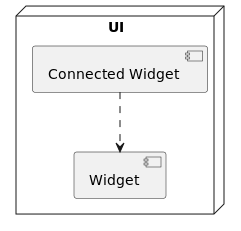

# WINTICKET が考えたモダンな Flutter アプリ設計
2022/6/15
>https://developers.cyberagent.co.jp/blog/archives/36149/
## 概要
- 全体設計は Clean Architecture
  - `Data`  `Domain`  `State`  `UI` の 4 つのレイヤーで構成
- Riverpod を使用して、Dependency Injection (DI) と状態管理
- Widget 周りの実装は主に Flutter Hooks 
- Web 界隈ではすでに宣言的 UI 技術が先行していて、知見も豊富
- Flutter は宣言的 UI を使用しているため、設計をする前に Web (主に React) 周りの知見も参考として取り入れた。
- React で Recoil という状態管理ライブラリが登場
  - Native で馴染んだ MVVM のような、よくある 1 ページ 1 ViewModel の構成では、ViewModel の膨大化と状態の共有の難しさに課題を感じた。
  - それと比べて、Recoil では、アプリの状態を複数で平行な状態で構成していて、コードの分離と状態の共有が非常に容易にできる
- 私は Recoil の利点を参考にすると先程挙げたような課題を解決できると思い、アプリに Recoil のコンセプトを取り入れたいと考えた。
- ちょうど Flutter 界隈にも Riverpod が登場し、 その設計は Recoil に非常に似ていて、Recoil 風な状態管理が実現しやすいと考え、 Riverpod を採用した。
  -  (ちなみに Riverpod の作者、 Remi 氏も両者似ているとTweet)

採用した Flutter Hooks は少し学習コストが高めですが、公式の書き方と比べると
- ボイラープレートコードが少ない
- ロジックの共有がしやすい

というメリットが大きいので、導入しました。
また Hooks Riverpod が存在するので、 Riverpod と Flutter Hooks が非常に相性がいいのもポイント

また、各レイヤーのテスタビリティを意識して、コード生成や Inversion of Control (IoC) を利用して、テストのしやすさを向上しました。

レイヤーの依存グラフは下記の図のようになります:


イメージしやすいように、ディレクトリ構造も先に貼っておきます。 これから順番に細かく説明していきます。
## ディレクトリ構造
```tree
.
└── lib/
    ├── data/
    │   ├── local/
    │   │   ├── secure_preferences.dart
    │   │   └── shared_preferences.dart
    │   ├── keirin/
    │   │   └── keirin_race.dart
    │   └── ...
    ├── domain/
    │   ├── keirin/
    │   │   ├── get_keirin_race.dart
    │   │   ├── get_keirin_race.fake.dart
    │   │   ├── get_keirin_race_odds.dart
    │   │   └── get_keirin_race_odds.fake.dart
    │   ├── ...
    │   ├── use_case.dart
    │   └── fake_use_case.dart
    ├── state/
    │   ├── keirin/
    │   │   ├── keirin_race_detail.dart
    │   │   ├── keirin_race_detail.fake.dart
    │   │   ├── keirin_race_odds.dart
    │   │   └── keirin_race_odds.fake.dart
    │   ├── ...
    │   ├── state_notifier.dart
    │   └── fake_state_notifier.dart
    └── ui/
        ├── widget/
        │   ├── button.dart
        │   ├── text.dart
        │   └── ...
        ├── domain_widget/
        │   ├── keirin/
        │   │   ├── keirin_app_bar.dart
        │   │   └── keirin_app_bar.story.dart
        │   ├── default_container/
        │   │   └── default_container.dart
        │   └── ...
        ├── page/
        │   └── keirin/
        │       ├── connected_keirin_race_page.dart
        │       ├── keirin_race_page.dart
        │       └── keirin_race_page.story.dart
        └── ...
```
この記事のサンプルに使用している Package のバージョンは以下になります:
```yaml
Hooks Riverpod : 1.0.4
Retrofit : 3.0.1+1
Shared Preferences : 2.0.13
Flutter Secure Storage : 5.0.2
Playbook Flutter : 0.0.3
```
## Data レイヤー

- Data レイヤーはビジネスロジックが必要な DataSource を持つレイヤー
- Protobuf/JSON リクエストを介してアクセス可能な API から提供されるサービスや、 Database/SharedPreferences などの永続化はこのレイヤーに置きます。
  - infra層とも呼ぶ
- Riverpod でインスタンスを提供し、Domain レイヤーに DI します。
  - ちなみに Repository Pattern でもう 1 回抽象することもよくあるが (少なくとも Android 界隈では)、
  - WINTICKET は同じデータを複数 DataSource から取得するケースがほとんどないので、 採用しない。
### Retrofit を使用した API サービスの自動生成
- API サービスは [Retrofit](https://pub.dev/packages/retrofit)を使って実装
  - Retrofit は簡単な Interface を定義することで、Interface に対応した API サービスを自動生成してくれます。
  - 冗長なコードを書かなくても済み、とても便利です。 
- また、テストの際に定義した Interface を Implement することで、data レイヤーの Mock/Fake も簡単に作成できます。

!!! example 例
    ```dart
    final keirinRaceDataSourceProvider = Provider<KeirinRaceDataSource>(
      (ref) => KeirinRaceDataSource(ref.watch(apiDioProvider)),
    );

    @RestApi()
    abstract class KeirinRaceDataSource {
      factory KeirinRaceDataSource(Dio dio) = _KeirinRaceDataSource;

      @GET('/v1/keirin/race/{raceNumber}')
      Future<KeirinGetRaceResponse> getRace({
        @Path('raceNumber') required int raceNumber,
      });

      // ...他のAPI
    }
    ```
### Interface を定義して永続化データの操作を共通化
- 現在 WINTICKET では `Shared Preferences` と `Flutter Secure Storage` を使って永続化データを管理しています。
-  2 つのライブラリの API は同じではないですが、保存しているデータ自体が Key/Value の Map 構造なので、 使いやすいラッパー `PreferencesDataSource` を作成しました。

#### PreferencesDataSource は以下のことを実現
- 永続化のデータを`Stream` 化できるようにして、データが変更されたときその値を Stream に反映
- Adapter Pattern を利用した`PreferencesDataSourceAdapter`を作成することで、 `Shared Preferences`と`Flutter Secure Storage`を意識せずに利用可能に
  - ちなみにラッパーの`PreferencesDataSource`の`API`設計は`AndroidX`の`DataStore`をインスパイアしています。

`PreferencesDataSource`と`PreferencesDataSourceAdapter`は以下のような感じで、実装の詳細は割愛させていただきます:
```dart
abstract class PreferencesDataSource {
  factory PreferencesDataSource(PreferencesDataSourceAdapter adapter) =
    // 実装の部分を省略させていただきます
    _PreferencesDataSourceImpl;

  // `Preferences`はMap型のデータを持っています
  // データが変わったら、新しい`Preferences`としてこのStreamに流します
  Stream<Preferences> get preferences;

  // `MutablePreferences`は`Preferences`の可変バージョンです
  // `action`で既存のデータに対して変更したら、変更後の値を永続化させ、上記のStreamに流します
  Future<void> edit(FutureOr<void> Function(MutablePreferences prefs) action);
}

abstract class PreferencesDataSourceAdapter {
  // SharedPreferencesなどに保存
  Future<void> save(String key, Object? value);

  // 永続化から削除
  Future<void> delete(String key);

  // 永続化から全てのデータをMap形として取得
  Future<Map<String, Object?>> getAll();
}
```
最後に、`Shared Preferences`と`Flutter Secure Storage`の`PreferencesDataSource`を`Provider`として定義します:
```dart
final sharedPreferencesDataSourceProvider = Provider<PreferencesDataSource>(
  (ref) {
    // `SharedPreferencesDataSourceAdapter`は`PreferencesDataSourceAdapter`を継承したものです
    final adapter = SharedPreferencesDataSourceAdapter(
      ref.watch(sharedPreferencesProvider),
    );
    return PreferencesDataSource(adapter);
  },
);

final securePreferencesDataSourceProvider = Provider<PreferencesDataSource>(
  (ref) {
    // `FlutterSecureStorageDataSourceAdapter`は`PreferencesDataSourceAdapter`を継承したものです
    final adapter = FlutterSecureStorageDataSourceAdapter(
      ref.watch(flutterSecureStorageProvider),
    );
    return PreferencesDataSource(adapter);
  },
);
```
## Domain レイヤー


!!! info info 再利用可能なビジネスロジック
    - Domain レイヤーは、複雑なビジネスロジックをカプセル化する役割を果たす。
    - そのカプセル化は UseCase という形で統一して表現

UseCase のインターフェース定義です:
```dart
abstract class UseCase<Param, Result> {
  Result call(Param param);
}
```
- `Param` は入力パラメーターで、`Result `は出力結果で、`Future` や `Stream` 型の `Result` が多いです。
### `UseCase` 及びその `Provider` の定義例:
```dart
final getKeirinRaceUseCaseProvider = Provider<GetKeirinRaceUseCase>(
  (ref) => GetKeirinRaceUseCase(
    ref.watch(keirinRaceDataSourceProvider),
  ),
);

class GetKeirinRaceUseCase
    extends UseCase<GetKeirinRaceUseCaseParam, Future<KeirinRaceDetailModel>> {
  GetKeirinRaceUseCase(this._keirinRaceDataSource);

  final KeirinRaceDataSource _keirinRaceDataSource;

  @override
  Future<KeirinRaceDetailModel> call(GetKeirinRaceUseCaseParam param) async {
    final response = await _keirinRaceDataSource.getRace(
      raceNumber: param.raceNumber,
    );
    return KeirinRaceDetailModel.fromV1(response);
  }
}
```
!!! tip `UseCase` を定義することで、コードが適切な粒度に分割ができ、ビジネスロジックも再利用しやすくなります。
### コード生成でテストビリティを担保
- `UseCase` を依存するロジックをテストしやすいように、 `Build Runner` を用いて、`UseCase` の Fake を自動生成するようにしています。

!!! example `UseCase` はとてもシンプルな Interface で、その Fake バージョンはこのように先に定義しておきます:
```dart
class FakeUseCase<Param, Result> extends UseCase<Param, Result> {
  Result Function(Param)? _callback;

  void resultCallback(Result Function(Param param) callback) {
    _callback = callback;
  }

  void result(Result v) {
    _callback = (_) => v;
  }

  @override
  dynamic noSuchMethod(Invocation invocation) {
    // UseCaseの`call`の実装を`_callback`にデリゲートします
    if (invocation.memberName == const Symbol('call')) {
      return _callback!(invocation.positionalArguments[0] );
    }
    super.noSuchMethod(invocation);
  }
}
```
そして、`FakeUseCase` を継承した各 UseCase は容易に生成できます:
```dart
class FakeGetKeirinRaceUseCase extends FakeUseCase<GetKeirinRaceUseCaseParam,
    Future<KeirinRaceDetailModel>> implements GetKeirinRaceUseCase {}
```
!!! note Mock 系パッケージの使用と比べて以下のメリットがあります:
    - セットアップコードが少ない
    - resultCallback と result という 2 つシンプルな API だけ使いこなせばいい

テストの際以下のように簡単にセットアップするだけで済みます:
```dart
void main() {
  late FakeGetKeirinRaceUseCase getKeirinRaceUseCase;
  late TestTarget testTarget;

  setUp(() {
    getKeirinRaceUseCase = FakeGetKeirinRaceUseCase();
    //Providerの内容を上書きする
    testTarget = ProviderContainer(overrides: [
      // テスト対象が依存するProviderの値をFakeでOverrideします
      getKeirinRaceUseCaseProvider.overrideWithValue(getKeirinRaceUseCase),
    ]).read(...);
  });

  test('it works', () {
    final keirinRaceModel = ...;
    // Fakeで返すものを設定します
    getKeirinRaceUseCase.result(Future.value(keirinRaceModel));

    testTarget.doSomething();

    expect(
      testTarget.someActualValue,
      someExpectedValue,
    );
  });
}
```
## State レイヤー

- State レイヤーは UI に表示する必要な状態データを持っていて、 `Unidirectional Data Flow`(単方向データフロー) によるデータの管理をしています。

!!! tip 単方向データフロー（Unidirectinal data flow)とは
    Unidirectional data flowとはざっくりいうと。
    「何をしたいか」 を「Action」で定義し、
    「Action」に応じて「State」を変化させ、
    「State」の変化を「View」に反映させる。
    Actionが各種クラスを横断し、Storeと呼ばれるドメイン層にて新しいStateが作成される。作成されたStateはViewにCallback等で通知される。このActionの動きとStateの動きがそれぞれ単方向なので、その名前がついている

State レイヤーには二種類があります:
- State
  - State を主に使用
  - State では `Single Source of Truth` に基づいて、アプリ状態を保持
- Selector
  - `Selector` が State から派生した状態

!!! tip Single Source of Truth（信頼できる唯一の情報源「SSOT」）
    SSOTとは、すべてのビジネスデータを 1 か所に集約すること
    ビジネスでよく用いられている言葉
    個人が「Single Source of Truth」を何で作るかで大事なのは、
    1. アイディアが浮かんだときすぐ書き始められるか？
    2. 過去に書いたものを簡単に見つけられるか？
    3. 時間の経過とともに努力の結果が蓄積できるか？
    → 現時点ではVscodeでのマークダウンノートが適切か
### StateNotifier(Provider) で State を定義
!!! info State は以下の特徴があります:
    - 状態は単一の不変な値として公開
    - 各種のイベントに応じて状態が変化可能
    - 状態を変更するロジックは内部に持ち、変更ロジックを隠蔽することで保守性を向上

- State は基本 StateNotifierProvider と StateNotifier で実装
- 一般的な MVVM の ViewModel が持つ状態と比べて、State の粒度は小さめで、 Recoil の Atoms に似ています。

### 非同期状態の実装
- 非同期状態は、アプリで最も一般的
- Riverpod が提供している FutureProvider や StreamProvider を使って便利に実装できますが、 WINTICKET アプリではそれらの使用をルール上禁止にしています。 
- 前述の通り、非同期状態でも StateNotifierProvider で実装するルールにしています。

!!! danger Riverpod 作者の Remi 氏はこのルールを支持せず
!!! question この要件だとAsyncNotifierで実現する可能性アリ

`StateNotifierProvider`のみにする理由は以下に挙げられる
- `StateNotifierProvider` は FutureProvider や `StreamProvider` の上位互換であるため、同等の挙動が実現できる
- `StateNotifier` を継承することで、Method 追加や挙動の変更など柔軟な実装ができる
- 統一の API になり、`Provider`の選定時に混乱しづらく、学習コストが減らせる
- `FutureProvider` と `StreamProvider` から公開している`AsyncValue`は、扱いにくい場合がある

`StateNotifier` の非同期状態を表現(`AsyncValue`を代替)するため、まず `AsyncEntity` というクラスを定義した
```dart
@freezed
class AsyncEntity<T extends Object> with _$AsyncEntity<T> {
  const factory AsyncEntity({
    T? entity,
    @Default(FetchStatus.idling) FetchStatus fetch,
    Object? error,
  }) = _AsyncEntity<T>;
}

enum FetchStatus {
  loading,
  refreshing,
  paging,
  idling,
}
```
`Riverpod` が提供している `AsyncValue` と比べ、`AsyncEntity`には以下の 2 つの利点があります。
- エラー、非同期状態を一括で表現可能。例えば、リフレッシュが失敗した場合でも、以前成功したデータを保持可能
- 非同期状態(`FetchStatus`)を柔軟に定義可能

続いて、`StateNotifier` を継承した `AsyncStateNotifier` を定義します:
```dart
abstract class AsyncStateNotifier<T extends Object>
    extends StateNotifier<AsyncEntity<T>>
    with AsyncEntityStateNotifierMixin<T> {
  AsyncStateNotifier() : super(AsyncEntity<T>()) {
    // StateNotifierの初期化で非同期状態も初期化します
    freshState();
  }

  // `fetch`をoverrideして、非同期状態の取得する方法を示します
  @protected
  Future<T> fetch();

  // `fetch`が実行して、適切に`StateNotifier.state`の更新をします
  //
  // 例:
  // - 初期状態
  // 　- AsyncEntity(entity: null, fetch: FetchStatus.idling, error: null)
  // - `freshState`を実行、`fetch`が成功
  //   - AsyncEntity(entity: null, fetch: FetchStatus.loading, error: null)
  //   - AsyncEntity(entity: SomeValue, fetch: FetchStatus.idling, error: null)
  // - `freshState`をもう一回実行、`fetch`が失敗
  //   - AsyncEntity(entity: SomeValue, fetch: FetchStatus.loading, error: null)
  //   - AsyncEntity(entity: SomeValue, fetch: FetchStatus.idling, error: SomeError)
  Future<void> freshState({
    FetchStatus fetchStatus = FetchStatus.loading,
    bool clearEntityOnFailure = false,
  }) => updateStateAsync(
          fetch,
          fetchStatus: fetchStatus,
          clearEntityOnFailure: clearEntityOnFailure,
      );

  // ...
}
```
コンストラクターで初期化して、状態を非同期で更新します。 fetch 結果を State に反映させる `updateStateAsync Method` は `AsyncEntityStateNotifierMixin` という Mixin に定義しています。
もし、コンストラクターでの初期化を必要とせず、任意のタイミングで状態を更新したい場合、`AsyncEntityStateNotifierMixin` を Mixin することで実装ができます。

`AsyncStateNotifier` を使った非同期状態の実装は以下のようになります:
```dart
class KeirinRaceDetailState extends AsyncStateNotifier<KeirinRaceDetailModel> {
  KeirinRaceDetailState(this._param, this._getKeirinRace);

  final KeirinRaceDetailStateParam _param;
  final GetKeirinRaceUseCase _getKeirinRace;

  // `fetch`をoverrideして、UseCaseを介して状態を取得
  @override
  Future<KeirinRaceDetailModel> fetch() => _getKeirinRace(
        GetKeirinRaceUseCaseParam(
          raceNumber: _param.raceNumber,
        ),
      );
}
```
最後に、`StateNotifierProvider` を使って Provider を定義します。

例:
```dart
final keirinRaceDetailStateProvider = StateNotifierProvider.autoDispose.family<
    KeirinRaceDetailState,
    AsyncEntity<KeirinRaceDetailModel>,
    KeirinRaceDetailStateParam>(
  (ref, param) => KeirinRaceDetailState(
    param,
    ref.watch(getKeirinRaceUseCaseProvider),
  ),
);
```
### State から派生した Selector
Selector の実装はとてもシンプルで、Provider の中で他の Provider を watch して、派生した状態を作ります。

例:
```dart
final isAuthenticatedSelectorProvider = Provider<bool>(
  // `authTokenStateProvider`はStateNotifierProvider
  (ref) => ref.watch(authTokenStateProvider)?.isNotEmpty ?? false,
);
```
### コード生成でテストビリティを担保
UseCase と似たように、 StateNotifierProvider を依存したものをテストしやくすくするようにコード生成を用いて、 自動で Fake を生成するようにしています。

同じく共通な親 Fake Class を定義します:
```dart
class FakeStateNotifier<T> extends StateNotifier<T> {
  FakeStateNotifier(T state) : super(state);

  @override
  set state(T value) {
    super.state = value;
  }

  @override
  T get state => super.state;

  @override
  dynamic noSuchMethod(Invocation invocation) async {
    // アプリ内定義したStateNotifierのpublic methodの返り値は`Future<void>`また`void`に制限しています
    // なのでこのままreturnができます
    if (invocation.isMethod) {
      return;
    }
    return super.noSuchMethod(invocation);
  }
}
```
これで`FakeStateNotifier`を継承した各`State`の`Fake` が生成できますが、`StateNotifier`に初期状態を渡さないといけないので、`Annotation` で渡すようにしています。 

`FakeState` という `Annotation` をつけた`StateNotifier` のみ `Fake` が生成されます:
```dart
@FakeState(AsyncEntity<KeirinRaceDetailModel>())
class KeirinRaceDetailState extends AsyncStateNotifier<KeirinRaceDetailModel> {
  // ...
}
```
生成された Fake は以下のような感じです:
```dart
class FakeKeirinRaceDetailState
    extends FakeStateNotifier<AsyncEntity<KeirinRaceDetailModel>>
    implements KeirinRaceDetailState {
  FakeKeirinRaceDetailState(
       [AsyncEntity<KeirinRaceDetailModel> state =
          const AsyncEntity<KeirinRaceDetailModel>()] )
      : super(state);
}
```
また、次に説明する UI レイヤーの `Visual Regression Test` のために、 全ての `StateNotifierProvider` を Fake で Override したリストを生成しています:
```dart
final defaultStateOverrides = <Override> [
  keirinRaceDetailStateProvider.overrideWithProvider((argument) =>
      StateNotifierProvider.autoDispose((ref) => FakeKeirinRaceDetailState())),
  userStateProvider.overrideWithValue(FakeUserState()),
  // others
] ;
```
## UI レイヤー

UI レイヤーでは主に描画に関連するものが入っており、 目的と用途によって以下の分け方(ディレクトリ)をしています:
- Widget: 色々なところに再利用されるWidget。
  - 例:AppTextButton、BouncedCard。
- Domain Widget: ドメイン知識を含む Widget
  - 例:SportRaceAppBar、BettingRaceTile
- Page: 一画面（URL）あたりに対応した Widget
  - 例:TopKeirinPage、KeirinRacePage
- そのほか
### State レイヤーに繋ぐ Connected Widget
Widget は Connected という Prefix がついているものと、ついていないものの二種類があります。
基本 Connected Widget は Connected ではないペアが存在します。例えば、`ConnectedKeirinRacePage` と `KeirinRacePage` のようなペアです。 Connected Widget のみが State レイヤーにアクセスすることが可能性で、必要な State を購読して、その値を Connected ではないペアに渡しています。

Hooks Riverpod の `HookConsumerWidget` を使用したサンプルコードは以下のようになります :
```dart
class ConnectedKeirinRacePage extends HookConsumerWidget {
  const ConnectedKeirinRacePage({
    Key? key,
  }) : super(key: key);

  @override
  Widget build(BuildContext context, WidgetRef ref) {
    // stateを購読します
    final user = ref.watch(userStateProvider);
    final race = ref.watch(keirinRaceDetailStateProvider);
    // 購読した値を渡します
    return KeirinRacePage(
      user: user,
      race: race,
    );
  }
}

class KeirinRacePage extends HookConsumerWidget {
  const KeirinRacePage({
    Key? key,
    required this.user,
    required this.race,
  }) : super(key: key);

  final UserModel user;
  final KeirinRaceDetailModel race;

  @override
  Widget build(BuildContext context, WidgetRef ref) {
    // user,raceを使用してUIを作ります
    return ...;
  }
}
```
Connected Widget は基本 Page ディレクトリにしか存在しないですが、いくつか Domain Widget ディレクトリにも存在します。 Widget ディレクトリには Connected が絶対に存在しません。 なので Connected Widget は比較的に少なく、依存関係がシンプルな Connected ではない Widget が一番多いです。

Connected Widget と Connected ではない Widget を明確に分離することで、テストがしやすくなります。 一番多い Connected ではない Widget は依存が少ないため、複雑なセットアップが不要で、簡単に Widget Test が書けます。


